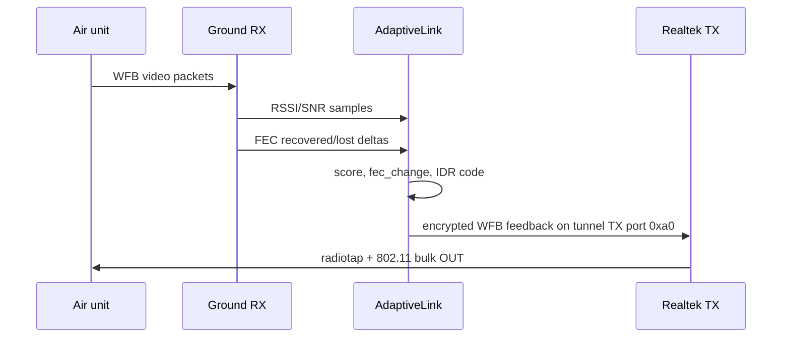

# Adaptive Link

Adaptive link is the feedback loop from the ground station to the air unit. It
lets the transmitter react to link quality by changing video and radio behavior.
The ground station reports what it is seeing; the air side decides how to react.



## Inputs

`openipc-rs` records:

- Realtek RSSI/SNR samples from packets matching the configured video channel,
- WFB FEC recovered and lost counters,
- packet-loss events that should request an IDR/keyframe burst.

The scoring logic follows the working PixelPilot/OpenIPC shape where it matters
on the wire: Realtek raw RSSI is mapped into the `1000..2000` score range, FEC
loss/recovery deltas drive `fec_change`, and the packet is sent periodically on
the tunnel uplink. The app still exposes raw RSSI and SNR separately so the UI
can show the underlying radio data rather than only the score.

## Feedback Format

The feedback text follows the aviateur and standalone `adaptive-link` ground
station format:

```text
<gs_time>:<score>:<score>:<fec_recovered>:<lost>:<rssi>:<snr>:<num_ants>:<noise_penalty>:<fec_change>[:<idr_code>]\n
```

The text is prefixed with a 32-bit big-endian length and then wrapped into a
2-byte-length-prefixed IPv4/UDP payload:

```text
10.5.0.1:54321 -> 10.5.0.10:9999
```

That payload is encrypted, FEC-wrapped, converted to radiotap plus 802.11, and
sent through the Realtek bulk-OUT endpoint on WFB tunnel/data uplink port
`0xa0` (`160` decimal), not the telemetry uplink port `0x90`.

The default `fec_change` thresholds match PixelPilot:

| Condition                           | `fec_change` |
| ----------------------------------- | ------------ |
| lost packets in the last second > 2 | 5            |
| recovered packets > 30              | 4            |
| recovered packets > 24              | 3            |
| recovered packets > 14              | 2            |
| recovered packets > 8               | 1            |

The transmitter-side adaptive-link process decides what those values mean for
bitrate, GOP, FEC denominator, and keyframe requests.

## Active Link Characterization

The feedback loop above is the production protocol. Active probing is a
separate commissioning and diagnostics tool that can measure operating
headroom before choosing a policy:

- `wfb_tx --mcs-sweep MCS0,MCS2,MCS4,...` changes the per-packet radiotap rate
  at a fixed dwell interval. A receiver can align delivery and SNR samples with
  the emitted dwell markers and select the highest rate that clears its target.
- `--thermal-poll-ms` records transmitter thermal drift during the sweep. It is
  a safety input, not another link-quality score.
- `RealtekDevice::start_continuous_tx[_async]` supplies a full-channel stimulus
  for spectral and thermal characterization. It is intentionally not used as a
  decodable link probe and should not be left running continuously.
- `retune[_async]` plus `read_rx_energy[_async]` lets an application scan a
  channel list for a continuous rendezvous beacon after feedback is lost.

These are explicit building blocks. Neither the driver nor `openipc-core`
silently changes channels, rates, receive chains, notches, or power behind an
application's back.

## What Adaptive Link Does Not Mean

Adaptive link is not the same thing as "the ground station automatically picks
TX power." In OpenIPC setups, the feedback packet gives the air unit enough
information to adjust behavior such as bitrate, FEC, and keyframe requests. Any
actual policy on the transmitter side belongs to the air unit.

## Ground-Side TX Power Override

Manual uplink TX-power override is implemented through Realtek TXAGC
programming for RTL8812/RTL8821 tables, RTL8814 command writes, and Jaguar3
per-path references. Jaguar1 accepts indexes `0..=63`; Jaguar3 uses its full
7-bit `0..=127` range. The API is exposed in native and browser paths, but still
needs live on-air validation across adapter models.

In the station UI this is the "Uplink TX power" slider shown when adaptive link
is enabled. In the CLI it is `--alink-tx-power POWER`, where `POWER` is a TXAGC
index accepted by the driver.

## Browser And Native Flow

Native:

```text
RX bulk transfers -> adaptive counters -> WFB uplink packet -> nusb bulk OUT
```

Browser:

```text
WebUSB RX transfers -> Rust/WASM counters -> WFB uplink packet -> WebUSB bulk OUT
```

The feedback construction is shared Rust. Only the USB transport is different.
