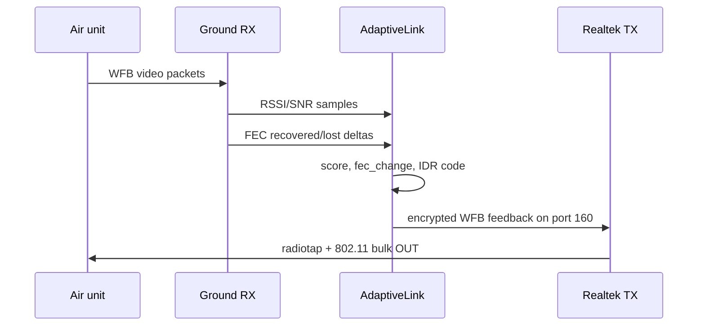

# Adaptive Link

Adaptive link is the feedback loop from the ground station to the air unit. It
lets the transmitter react to link quality by changing video and radio behavior.



## Inputs

`openipc-rs` records:

- Realtek RSSI/SNR samples from packets matching the configured video channel,
- WFB FEC recovered and lost counters,
- packet-loss events that should request an IDR/keyframe burst.

## Feedback Format

The feedback text follows the aviateur and standalone `adaptive-link` ground
station format:

```text
<gs_time>:<score>:<score>:<fec_recovered>:<lost>:<rssi>:<snr>:<num_ants>:<noise_penalty>:<fec_change>[:<idr_code>]\n
```

The text is prefixed with a 32-bit big-endian length and then wrapped into a
2-byte-length-prefixed IPv4/UDP payload:

```text
10.5.0.1:54321 -> 10.5.0.10:9999
```

That payload is encrypted, FEC-wrapped, converted to radiotap plus 802.11, and
sent through the Realtek bulk-OUT endpoint on WFB radio port 160.

## Power Control

Manual uplink TX-power override is implemented through Realtek TXAGC
programming for RTL8812/RTL8821 register tables and RTL8814 command writes. It
is exposed in native and browser paths, but still needs live on-air validation
across chip families.
