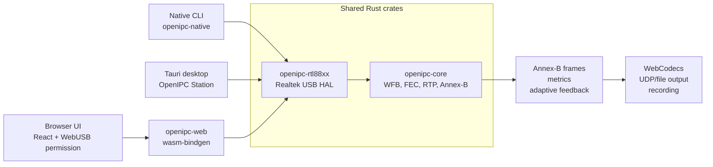
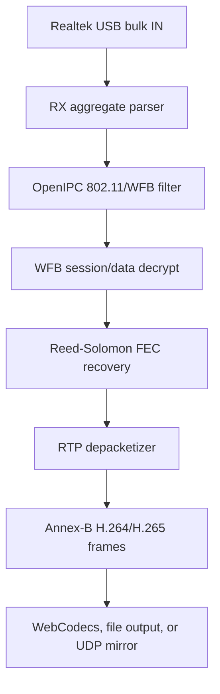
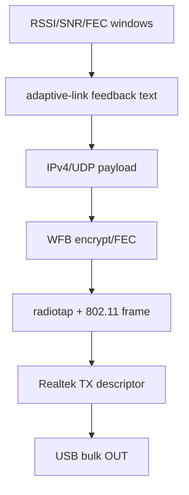

# Architecture

`openipc-rs` keeps protocol logic in shared Rust crates and pushes platform
APIs to the edges.

## Shared Rust

- Realtek RX aggregate parsing from 24-byte USB RX descriptors.
- OpenIPC/WFB 802.11 frame filtering.
- WFB session-key handling, data decryption, FEC recovery, and counters.
- RTP parsing and H.264/H.265 depacketization into Annex-B frames.
- Adaptive-link quality windows and feedback packet construction.
- WFB uplink encryption, FEC parity generation, and 802.11 wrapping.
- Realtek TX descriptor construction for monitor-injection packets.

## Native Edges

- USB discovery, open, reset, claim, endpoint discovery, and bulk IO through
  `nusb`.
- CLI output as Annex-B or RTP-over-UDP.
- Tauri commands/events for the desktop station UI.

## Browser Edges

- JavaScript owns the WebUSB permission prompt because browsers require a user
  gesture.
- The granted `UsbDevice` is passed into Rust/WASM through `nusb-webusb`,
  imported as `nusb`.
- Rust/WASM initializes the Realtek adapter, performs bulk IN/OUT, and returns
  typed video frames and metrics to React.
- React uses WebCodecs for playback and canvas capture for recording.

## Data Flow

Adaptive-link feedback flows the other direction:

