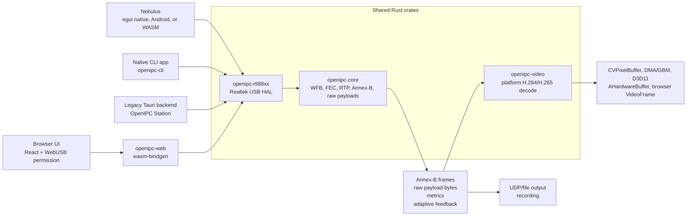
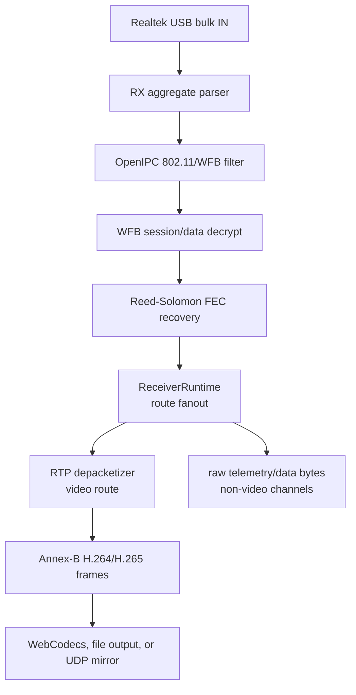
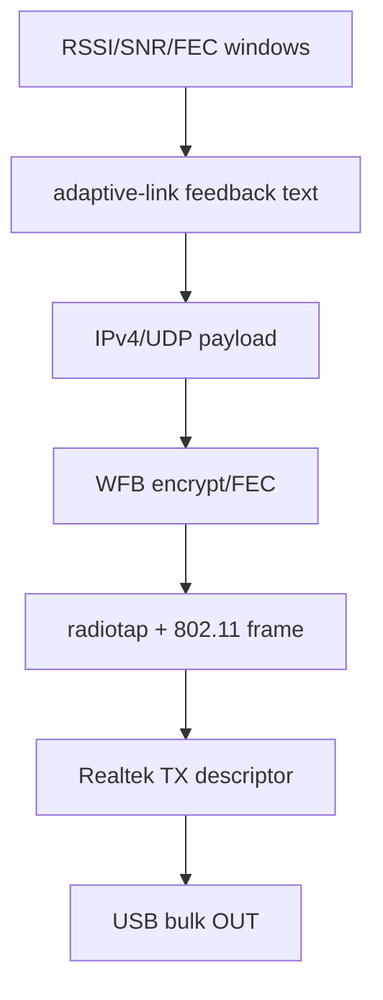

# Architecture

`openipc-rs` keeps protocol logic in shared Rust crates and pushes platform
APIs to the edges. The main design goal is that the browser and native paths do
not reimplement the OpenIPC packet stack in different languages.

## Shared Rust Responsibilities

- Realtek RX aggregate parsing from 24-byte USB RX descriptors.
- OpenIPC/WFB 802.11 frame filtering.
- WFB session-key handling, data decryption, FEC recovery, and counters.
- RTP parsing and H.264/H.265 depacketization into Annex-B frames.
- Decoder configuration, bounded frame queues, and decoder statistics in
  `openipc-video`; the actual decoder and retained output surface remain
  platform-specific across desktop, Android, and WebAssembly.
- Generic recovered-payload taps for non-video WFB radio ports. The core crate
  returns bytes and packet sequence metadata; application crates decide whether
  those bytes are MAVLink, MSP, CRSF, IP, or something else.
- Adaptive-link quality windows and feedback packet construction.
- WFB uplink encryption, FEC parity generation, radiotap headers, and 802.11
  wrapping.

## Platform Responsibilities

The shared crates do not try to hide every platform difference. They hide the
protocol details, then let each target own the APIs that make sense there.

### Native

- USB discovery, open, reset, claim, endpoint discovery, and bulk IO through
  `nusb`.
- Realtek TX descriptor construction for monitor-injection packets before USB
  bulk OUT.
- CLI output as Annex-B or RTP-over-UDP.
- Nebulus RX-thread ownership of bulk-IN, protocol state, and decoder submit;
  a lower-priority bounded radio worker owns auxiliary bulk-OUT and Jaguar3
  maintenance.
- Tauri commands/events for the legacy desktop station UI.

### Browser

- JavaScript owns the WebUSB permission prompt because browsers require a user
  gesture.
- The granted `UsbDevice` is passed into Rust/WASM through `nusb-webusb`,
  imported as `nusb`.
- Rust/WASM initializes the Realtek adapter, performs bulk IN/OUT, and returns
  typed video frames and metrics to React.
- React uses WebCodecs for playback and canvas capture for recording. Rust/WASM
  applications may instead drive `openipc_video::WebDecoder` and receive the
  same browser `VideoFrame` handles in Rust.
- Nebulus drives `openipc_video::WebDecoder` directly and keeps WebUSB,
  protocol reconstruction, and WebCodecs orchestration in Rust/WASM.
- Its persistent bounded WebUSB OUT queue and separately cancellable Jaguar3
  maintenance task allow the receive future to continue while those promises
  are pending.

### Desktop Applications

The legacy Tauri app uses the same React components as its browser build, but
the receive loop runs in native Rust. Encoded Annex-B frames and metrics are
sent to the UI. WebCodecs still performs video decode inside the WebView, so the
desktop path avoids copying decoded video surfaces through Rust.

Nebulus follows a different desktop boundary. Its native worker submits
Annex-B access units to `openipc-video`, receives a retained platform decoder
surface, and hands the newest presentable frame to egui. That path avoids the
WebView entirely.

## Copy Boundaries

Legacy Station's largest regular boundary is the encoded video frame returned
from Rust/WASM or native Tauri Rust to JavaScript. Decoded pixels then stay in
WebCodecs and the browser/WebView canvas.

Nebulus has no JavaScript frame callback. It keeps encoded video and decoder
control in Rust, coalesces retained native decoder surfaces, uploads NV12
planes to persistent GPU textures, and performs color conversion in a shader.
CPU RGBA conversion is only a compatibility fallback. Direct IOSurface,
DMA-BUF, and D3D11 imports could remove the remaining plane copy.

The receive worker returns each bulk-IN buffer to `nusb` as soon as the parser
and WFB runtime release their borrow. It then moves the completed Annex-B
access unit into the decoder before processing audio, UDP, VPN, adaptive-link,
or diagnostic output. This ordering keeps optional routes out of the video
critical path.

On Android MediaCodec renders into a SurfaceTexture-backed external GLES
texture; the UI boundary carries only presentation metadata and the paint
callback latches the newest image. In the browser, WebCodecs `VideoFrame` is uploaded directly to a
persistent WebGL texture; decoded pixels do not pass through a WASM byte array.

## Data Flow

Adaptive-link feedback flows the other direction:

