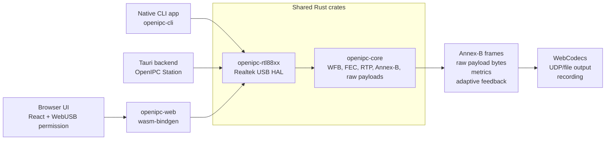
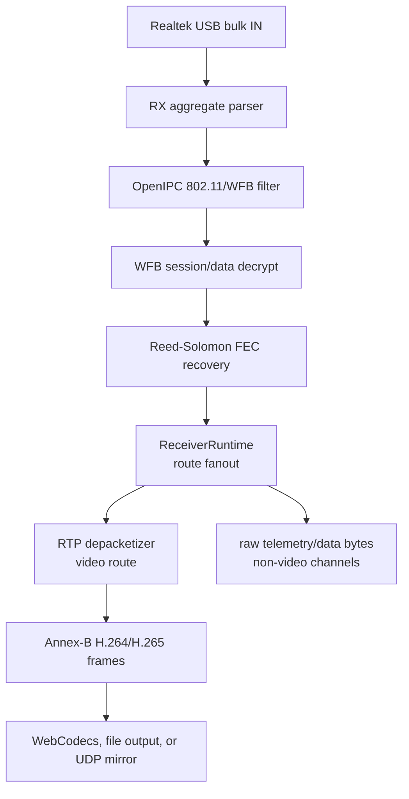
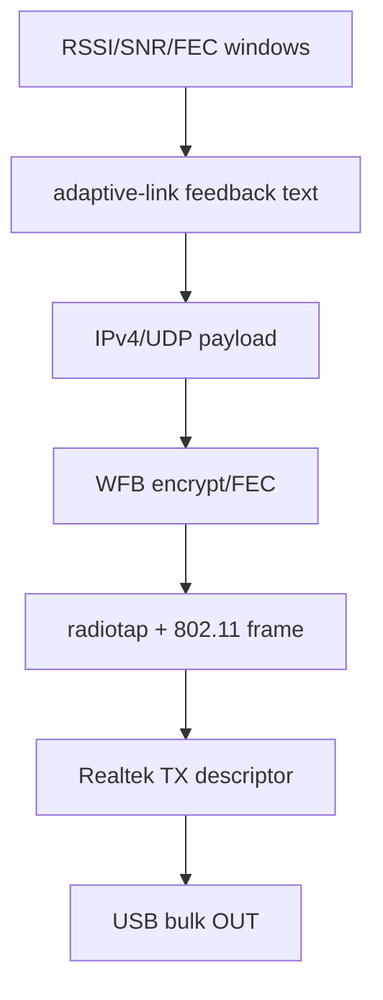

# Architecture

`openipc-rs` keeps protocol logic in shared Rust crates and pushes platform
APIs to the edges. The main design goal is that the browser and native paths do
not reimplement the OpenIPC packet stack in different languages.

## Shared Rust Responsibilities

- Realtek RX aggregate parsing from 24-byte USB RX descriptors.
- OpenIPC/WFB 802.11 frame filtering.
- WFB session-key handling, data decryption, FEC recovery, and counters.
- RTP parsing and H.264/H.265 depacketization into Annex-B frames.
- Generic recovered-payload taps for non-video WFB radio ports. The core crate
  returns bytes and packet sequence metadata; application crates decide whether
  those bytes are MAVLink, MSP, CRSF, IP, or something else.
- Adaptive-link quality windows and feedback packet construction.
- WFB uplink encryption, FEC parity generation, radiotap headers, and 802.11
  wrapping.

## Platform Responsibilities

The shared crates do not try to hide every platform difference. They hide the
protocol details, then let each target own the APIs that make sense there.

### Native

- USB discovery, open, reset, claim, endpoint discovery, and bulk IO through
  `nusb`.
- Realtek TX descriptor construction for monitor-injection packets before USB
  bulk OUT.
- CLI output as Annex-B or RTP-over-UDP.
- Tauri commands/events for the desktop station UI.

### Browser

- JavaScript owns the WebUSB permission prompt because browsers require a user
  gesture.
- The granted `UsbDevice` is passed into Rust/WASM through `nusb-webusb`,
  imported as `nusb`.
- Rust/WASM initializes the Realtek adapter, performs bulk IN/OUT, and returns
  typed video frames and metrics to React.
- React uses WebCodecs for playback and canvas capture for recording.

### Desktop

The Tauri desktop app uses the same React components as the browser build, but
the receive loop runs in native Rust. Encoded Annex-B frames and metrics are
sent to the UI. WebCodecs still performs video decode inside the WebView, so the
desktop path avoids copying decoded video surfaces through Rust.

## Copy Boundaries

The largest regular boundary is the encoded video frame returned from Rust/WASM
to JavaScript. Raw USB transfers enter Rust one transfer at a time, and decoded
pixels stay inside the browser/WebView decoder path. That is the main reason the
app does not decode video inside Rust today.

## Data Flow

Adaptive-link feedback flows the other direction:

