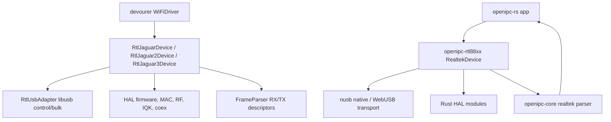

# Devourer Parity Audit

This page tracks the driver-level audit against the current `devourer` tree.
The goal is wire and register parity: `openipc-rs` should issue the same
firmware, MAC, RF, RX, and TX operations while keeping a Rust-native API and
using `nusb` instead of libusb directly.

The reference commits used for this pass were:

```text
OpenIPC/devourer f542b06 Add RTL8812EU / RTL8822EU (rtl8822e) support (#124)
OpenIPC/devourer 55f0649 Split Jaguar1 + compile-time per-chip selection (#125)
OpenIPC/devourer 94d2fa9 Fix rtl8822c 2.4 GHz RX deafness (#138)
OpenIPC/devourer e926b47 Jaguar1 TX-power parity (#139)
OpenIPC/devourer de4e8b4 Jaguar2 RTL8822BU/RTL8812BU userspace driver (#157)
OpenIPC/devourer ce6dabe Concurrent TX+RX on one adapter (#158)
OpenIPC/devourer 92f7802 RX CSI masking / NBI notch controls (#159)
OpenIPC/devourer 19460a6 Jaguar3 promiscuous RX and 8822E TXAGC fix (#160)
OpenIPC/devourer 1ac94c2 Three-generation beamforming self-sounding (#161)
OpenIPC/devourer 5db0015 RTL8822E narrowband MAC/BB fixes (#162)
OpenIPC/devourer 9f887f8 Jaguar3 40/80 MHz and 40-in-80 (#166)
OpenIPC/devourer bad37a8 Previous audited baseline
OpenIPC/devourer 7a7ab38 Jaguar1/Jaguar2 CW tone and RTL8812 EFUSE retry
OpenIPC/devourer d31f915 Persistent RX URBs with infinite timeout
OpenIPC/devourer 35bcdb7 Exclusive lock and claim-before-reset USB ownership
OpenIPC/devourer 341eb54 Jaguar3 CW tone and DACK/IQK USB retry
OpenIPC/devourer 0d5cd60 RTL8821C / RTL8811CU Jaguar2 support
OpenIPC/devourer 300cea9 RTL8821C CW single-tone support
OpenIPC/devourer d2e45e8 Jaguar3 PHY status and RTL8822E 2.4 GHz RXBB fixes
OpenIPC/devourer 0a7b9eb Frame-free RX energy and NHM sensing
OpenIPC/devourer 40f2656 Modulated continuous TX and active-link primitives
OpenIPC/devourer 7a5123e MCS-headroom probe, thermal overlay, and rendezvous beacon
OpenIPC/devourer 4df2a3b Adaptive-link sensing and interference-control documentation
OpenIPC/devourer 57cec5d Animated NHM documentation
OpenIPC/devourer b27da75/df98688 Visual RF, TX, sounding, diversity, and hopping documentation
OpenIPC/devourer bd44411 FastRetune on all generations and active two-ended sounding sweep
OpenIPC/devourer 3ec1ab1 Write-only compose caches and kickless FHSS retuning
OpenIPC/devourer d19035d Runtime TX-power and all-generation thermal API
OpenIPC/devourer 31fac7b Sticky Jaguar1 runtime RX-path masks
OpenIPC/devourer 686c42f Link-health classifier
OpenIPC/devourer c0f7609 Jaguar2 per-packet TXPWR_OFSET
OpenIPC/devourer aabb011 TX capabilities and 1T1R STBC guard
OpenIPC/devourer 50e125a Safe Jaguar3 MAC EDCCA research control
OpenIPC/devourer 61a9912 Driver-side TX submission statistics
OpenIPC/devourer e0e5307 Rolling RX quality and passive noise floor
OpenIPC/devourer d7addaa Self-gated Jaguar3 TX beamforming apply
OpenIPC/devourer 645eed0 Typed construction-time device configuration
OpenIPC/devourer a84a6f0 Adapter-health/EFUSE stability diagnostics
OpenIPC/devourer 40e3a2a Bus-neutral refactor and Linux VFIO PCIe transport
OpenIPC/devourer 21994e1 Adapter capabilities and extended 5 GHz tuning
OpenIPC/devourer e1896ab/d396f58/a86a16f Jaguar2 narrowband, thermal, KFree, spur, and MAC parity
OpenIPC/devourer eb207c2/aef9b69 RTL8812/RTL8814 5/10 MHz narrowband
OpenIPC/devourer 67a2ddb Crystal-cap control and closed-loop CFO tracking
OpenIPC/devourer 9e91f6e Fast bandwidth-only switching on all generations
OpenIPC/devourer c37ea5f Hardware TSF and receive timestamps
OpenIPC/devourer dad6d6d/c991805 Hardware beacons, TX-egress TSF, and TsfSync
OpenIPC/devourer 11dff09 Latest audited baseline; PCIe reference tooling excluded
```

## Audit Plan

The risky parts of this rewrite are the places where small byte/register
differences do not fail at compile time. This is the checklist used for each
chip family:

| Area                 | What to compare                                                                   | Rust location                                                | Failure mode                                   |
| -------------------- | --------------------------------------------------------------------------------- | ------------------------------------------------------------ | ---------------------------------------------- |
| USB discovery        | VID/PID table, interface claim, endpoint selection, endpoint override             | `openipc-rtl88xx::SUPPORTED_DEVICES`, `RealtekDevice`        | wrong adapter, wrong bulk OUT endpoint, no TX  |
| Control transfer ABI | Realtek vendor request, register width, endian order                              | `async_driver.rs`, `device.rs`                               | reads look plausible but write wrong registers |
| Firmware load        | power-on state, chunking, reserved-page/DDMA flow, firmware-ready polls           | `async_firmware*.rs`, `async_jaguar2.rs`, `async_jaguar3.rs` | warm-start works, cold-plug fails              |
| MAC setup            | queue/FIFO, DMA, RX engine, WMAC options                                          | `async_mac.rs`, `async_jaguar3.rs`                           | no bulk-IN frames or FIFO stalls               |
| EFUSE/RFE            | logical-map decoding, RFE pinmux/table choices, TX power data                     | `async_efuse.rs`, `async_tables.rs`, `async_tx_power.rs`     | works on one dongle revision, fails on another |
| PHY/RF tables        | table data, conditional opcodes, pseudo-delay entries, write order                | `rtl_data.rs`, `data/*`, table loaders                       | no RX sensitivity, wrong band, unstable TX     |
| Channel/BW           | RF18 band bits, SCO, DFIR, 5/10 MHz reclock, 40/80 primary index and DATA_SC      | `async_radio.rs`, `async_jaguar2.rs`, `async_jaguar3.rs`     | tuned to the wrong channel or sample rate      |
| RX descriptors       | field offsets, packet/C2H split, drvinfo/shift offset, 8-byte aggregate alignment | `openipc-core::realtek`                                      | corrupted 802.11 frames or missed C2H reports  |
| TX descriptors       | radiotap RATE/MCS/VHT parsing, 5 GHz CCK clamp, descriptor checksum               | `openipc-rtl88xx::tx`                                        | bulk OUT succeeds but nothing goes on-air      |
| Runtime polling      | coex keepalive, thermal power tracking, PHYDM/watchdog hooks                      | app-owned RX loop plus explicit driver APIs                  | sustained TX degrades or stops                 |
| Shutdown             | stop TRX, close RX filter, power-off sequence                                     | `shutdown_monitor*`                                          | adapter wedges until unplug/replug             |

## Current Mapping



`openipc-rs` deliberately does not copy devourer's class layout. The important
boundaries are:

- `openipc-rtl88xx` owns USB, registers, firmware, RF, TX descriptor building,
  diagnostics, and explicit runtime hooks.
- `openipc-core` owns byte-level RX aggregate parsing plus WFB/RTP/FEC payload
  handling.
- apps own scheduling: receive loops, periodic diagnostics, native workers,
  and WebUSB UI timing.

## Executed Checks

### Jaguar2 RTL8811CU / RTL8821CU / RTL8812BU / RTL8822BU

The Jaguar2 path is separate from both the older 8812A HAL and Jaguar3. The
Rust driver now mirrors the new devourer implementation:

- authoritative `SYS_CFG2` IDs `0x0a` and cold transient `0x50`, plus
  `0bda:b812`, `0bda:b82c`, and `2357:012d` discovery IDs,
- one-path/two-path selection from `SYS_CFG1` bit 27,
- 161,240-byte firmware, reserved-page packet-offset handling, IDDMA transfer,
  checksum/ready polling, failure cleanup, and Devourer's two-attempt CPU-reset
  retry nested inside its four-attempt full pre-init + card OFF/ON recovery loop,
- exact monitor RCR `0x7000002f`; the Jaguar1-style bits at 11/12/13 are not
  set because they suppress ambient frames on Jaguar2,
- RTL8821C PHY-status setup writes `REG_RX_DRVINFO_SZ=4` and the
  `REG_TRXFF_BNDY+1` low-nibble fix so the descriptor reports the 32-byte block,
- eight persistent bulk-IN transfers and the same 100 ms false-alarm/DIG step
  while an RX loop is active,
- exact 20/40-in-80 and 20-in-40 `DATA_SC` mapping, per-packet power LUT, and
  32-byte descriptor checksum span,
- HalMAC queue, protocol, EDCA, WMAC, USB aggregation, H2C, and BB/RF enable
  sequences,
- generated MAC/PHY/AGC/radio/TX-limit data imported reproducibly from the
  reference checkout and checked into the Rust crate,
- 20/40/80 MHz RF/RFE channel setup, post-IQK TRX reassertion, LCK, full
  software IQK, RFE mux, coex grant, DIG, and calibrated TX power,
- common 24-byte HalMAC RX descriptors and 48-byte TX descriptors, with the
  RTL8822B-specific checksum over the first 32 bytes only.

The importer is intentionally a development tool. Building and publishing the
crate does not require a devourer checkout.

RTL8821C is represented as its own one-path family, selected by `SYS_CFG2`
chip ID `0x09` and the `0bda:c811` reference PID. It uses its own firmware,
power sequence, 512-page TX FIFO layout, PHY/AGC/RF tables, RF-set/channel
programming, antenna grant, TX-power limits, and CW sequence. It never falls
through to the two-path RTL8822B tables.

### Jaguar3 RTL8812CU/EU and RTL8822CU/EU

The current Rust driver includes the new devourer Jaguar3 work:

- RTL8822C PIDs `0bda:c812`, `0bda:c82c`, and `0bda:c82e`.
- RTL8822E PIDs `0bda:881c`, `0bda:a81a`, `0bda:e822`, and `0bda:a82a`, plus
  ambiguous `0bda:8812`, `0bda:881a`, and `0bda:881b` devices selected by the
  authoritative `SYS_CFG2` chip ID (`0x17`; RTL8822C is `0x13`).
- 24-byte Jaguar3 RX descriptor layout with packet length, CRC/ICV flags,
  driver-info size, shift size, RX rate, and C2H report bit.
- 48-byte Jaguar3 TX descriptor layout, including the 16-bit descriptor
  checksum algorithm from `cal_txdesc_chksum_8822c`.
- Firmware, MAC, USB, BB/AGC/RF, RFK, DACK, IQK, beamforming setup, monitor RX
  filters, TX path enable, WiFi-only coex setup, H2C keepalives, and thermal
  power/LCK tracking.
- 5 MHz and 10 MHz narrowband retiming, including RTL8822E MAC clock, CFR,
  shaping, IGI, and DACK reset steps.
- Native 40 MHz and 80 MHz RF/BB/MAC setup, primary-subchannel programming,
  and 40 MHz frame placement in the lower half of an 80 MHz configured channel.
- Promiscuous RCR AAP and the RTL8822E combined TX/RX protection that leaves
  path-B's OFDM TXAGC reference at the table value while retaining the rest of
  the per-rate power programming.
- TX power override writes the same flat TXAGC reference class used by
  devourer for monitor inject/adaptive-link experiments.
- Clean shutdown now mirrors devourer `Stop()`: halt TRX through `CR`, close
  `RCR`, then run the 8822C card-disable power sequence.
- RTL8822C channel changes now include the vendor 3-wire reset bracket, gated
  RXBB write, RF18 read-modify-write, per-band CCK/OFDM AGC tables, CCK RX-IQ
  control, and force-anapar writes. Devourer validated this sequence as the fix
  for zero CCA and no receive on 2.4 GHz. These writes are gated away from the
  separate RTL8822E channel path.

The RTL8822E-specific path additionally includes:

- the 199,928-byte NIC firmware and exact AGC, PHY, PHY-PG, radio A/B, and RFK
  tables from `f542b06`; a full-array comparison against devourer passes for all
  eight arrays,
- V1 physical EFUSE reads with software power-cut and burst mode, the two-byte
  `0x3X` packed-map format, thermal baselines, and per-channel/path TX power,
- RFE fallback 21 for unprogrammed bare modules, PA-bias trim, RFE 21-24 antenna
  switching, GPIO/pad pinmux, and band-specific TX scaling/shaping,
- chip-specific DACK, IQK, TXGAPK, DPK bypass, and 5 GHz thermal compensation,
- the 7-bit Jaguar3 TXAGC range (`0..=127`) instead of Jaguar1's `0..=63`.

Regression tests now lock several high-risk bytes:

- Jaguar3 RX descriptor field positions and payload offset after drvinfo/shift.
- C2H report detection through descriptor word2 bit 28.
- Jaguar3 TX descriptor field offsets.
- 8822C TX descriptor checksum recomputation.
- 5 GHz CCK-rate requests clamped to OFDM before descriptor encoding.
- RTL8822E chip-ID overrides for shared PIDs, EFUSE block decoding, 5 GHz
  channel groups, TX-power differential sign extension, TXGAPK gain arithmetic,
  and reference-data boundaries.

### Jaguar1 RTL8812AU / RTL8821AU / RTL8814AU

The Rust code tracks the devourer behavior that matters for OpenIPC use:

- supported Realtek/OEM VID/PID discovery,
- firmware load and MAC/RF bring-up,
- the normal 470-word RTL8812 `CONFIG_BB_PHY_REG` table used by both the
  original browser fork and current devourer; the separate four-word
  manufacturing-test override is not used for receiver initialization,
- the pre-table BB/RF domain enable sequence, PHY/AGC inter-write delays, and
  RF-table `0xfe`/`0xffe` delay markers,
- chip-specific crystal-cap masks for RTL8812 (`0x7ff80000`), RTL8821
  (`0x00fff000`), and RTL8814 (`0x07ff8000`),
- RTL8821's cut-specific `SYS_CFG+3` MAC adjustment and 1T1R BB path setup,
- RTL8814's complete two-stage BB/RF reset sequence and post-table RF RCK1
  copy from path A to paths B, C, and D,
- RFE-aware table selection,
- EFUSE TX power data,
- monitor filters and RX aggregate parsing,
- radiotap-driven TX descriptor building,
- RTL8814 firmware mode/chunk controls,
- RTL8812/RTL8814 IQK,
- RTL8812 power tracking,
- PHYDM false-alarm/DIG watchdog hooks,
- C2H and RTL8814 TX-status report surfacing.
- vendor-correct 5 GHz TX-power groups (`60..98` and `100..106`) and
  `EFUSE -> chip default -> generic default` fallback for unprogrammed base
  cells,
- optional RX-chain masking through `MonitorOptions::rx_path_mask`,
  `RealtekDevice::set_rx_path_mask[_async]`, and the WASM `setRxPathMask`
  binding.

The Rust crate keeps these as explicit APIs. The app decides whether they run
in a native worker thread, a browser loop, or a Web Worker.
Devourer's timed `DEVOURER_RX_PATHS=mask:mask@milliseconds` mode is a
measurement harness, not hidden HAL state: Rust apps can schedule the explicit
mask setter on their existing worker or browser timer.

### Shared RX/TX Research Controls

The newer generation-neutral additions are public Rust APIs rather than being
limited to demo environment variables:

- `arm_beamforming_sounder_async` configures the shared MAC sounding engine and
  Jaguar3's additional RF/BB mode table.
- `arm_beamformee_async` configures an unassociated SU or MU responder for a
  beamformer MAC. `parse_beamforming_report` recognizes returned HT/VHT action
  frames and exposes their MIMO-control summary.
- `RealtekTxOptions::beamforming_ndpa` sets the per-generation NDPA, NAV,
  fallback, sequence, and broadcast fields before descriptor checksum.
- `apply_csi_mask_async` and `apply_nbi_notch_async` select the correct Jaguar1,
  Jaguar2, or Jaguar3 register recipe. The center-frequency and tone
  enumeration helpers are testable without USB hardware.
- Native `DEVOURER_RX_CSI_MASK` and `DEVOURER_RX_NBI` remain accepted through
  `MonitorOptions::from_env`; browser apps use the same controls through typed
  WebUSB methods.
- `start_cw_tone_async` and `stop_cw_tone_async` implement the SDR-validated
  Jaguar1, Jaguar2, and Jaguar3 MP carrier recipes. They snapshot RF/BB state,
  use Jaguar3's HSSI write-only RF0 path, drive RTL8822E RFE pins after arming,
  and restore normal TX/RX state when stopped. Native drop adds a best-effort
  safety restore; WebUSB callers explicitly await `stopCwTone` or shutdown.
  `openipc-web` exports the operations as `startCwTone` and `stopCwTone`.
- `start_continuous_tx_async`, `retune_async`, and `read_rx_energy_async`
  provide the three primitives used by devourer's rendezvous test: park a
  modulated beacon, scan candidate channels without another cold start, and
  compare frame-free OFDM/CCK energy. This remains app-owned policy rather than
  a hidden driver loop.
- `wfb_tx --mcs-sweep` applies a comma-separated rate ladder to newly emitted
  packets at a configurable dwell interval. It also supports periodic thermal
  markers, matching the useful behavior of devourer's MCS-headroom probe while
  retaining the Rust per-packet radiotap TX path.
- `fast_retune[_async]` mirrors Devourer's generation-specific lean hop path
  through `11dff09`.
  Jaguar1 caches per-path RF18 and channel buckets; Jaguar2 also applies its
  RF-BE/DF channel constants while omitting the hardware-validated unnecessary
  per-hop RX/IGI kick; Jaguar3 preserves the RF18/RXBB ordering,
  anapar update, AGC/SCO/DFIR buckets, and per-hop BB reset. Same-band hops keep
  the active width and primary offset. Band changes and RTL8814 automatically
  use the full retune path.
- Jaguar2 and Jaguar3 use lazily primed full-dword compose caches for registers
  that would otherwise require a USB read-modify-write. Steady hops are
  write-only except for channel-bucket transitions. The Rust driver invalidates
  those caches after full tuning, bandwidth changes, and Jaguar3 TX-power
  programming. `openipc_rtl88xx::hop_prof` trace logs expose per-stage and total
  hop time; native builds also accept `DEVOURER_HOP_PROF=1`.
- `openipc-core` owns the shared channel/frequency conversion and sweep grammar.
  Its radiotap CHANNEL builder/parser lets `RealtekDevice` retune before USB TX
  descriptor construction, matching Devourer's per-packet hopping boundary.
- Nebulus uses the fast path for idle channel scans and records SNR, EVM,
  retune duration, and fast/full-path selection in scan results and support
  bundles. Active two-ended sounding remains application policy: callers
  combine these primitives with their own probe traffic and dwell schedule
  instead of starting a hidden driver thread.

### Runtime Link And Adapter Health

The `3ec1ab1..11dff09` portable runtime APIs are represented directly in Rust:

- `TxPowerCaps`, `set_tx_power_offset_qdb[_async]`,
  `set_tx_power_index_override[_async]`, and `TxPowerState` implement the
  sticky calibrated-table offset plus optional flat-index model. Offsets are
  quantized in quarter-dB, folded after the calibrated/regulatory table, and
  expose rail saturation.
- Jaguar2 reads radiotap `DBM_TX_POWER` as a relative per-frame trim and maps
  it to the measured descriptor LUT: `0, -3, -7, -11, +3, +6 dB`.
- `TxCapabilities` reports stream count, STBC, LDPC, SGI, and maximum width.
  Descriptor building clears STBC on a 1T1R adapter, as Devourer does.
- `TxStats` tracks submissions and final failures, retaining whether the last
  failure was timeout/backpressure, stall, disconnect, or another error.
- `RxQualityAccumulator` drains windowed RSSI/SNR/EVM, computes the passive
  `RSSI - SNR` noise floor, and combines it with `RxEnergy` through the measured
  `LinkHealth` classifier.
- `probe_efuse_stability[_async]` compares fresh physical EFUSE reads;
  `FirmwareBootStatus` preserves the last initialization result; and
  `classify_adapter_health` grades those with an application RX smoke test.
- `arm_transmit_beamforming_async` programs Jaguar3's beamformer entry. The
  apply bit is self-gated until `observe_beamforming_report` sees a VHT
  compressed report from the configured peer.
- `set_cca_disabled[_async]` contains only Devourer's safe MAC EDCCA writes.
  The vendor BB recipe is intentionally absent because it was measured to make
  monitor RX deaf to OFDM.
- `AdapterCapabilities`, `ActiveRxPaths`, `set_crystal_cap[_async]`, and
  `CfoTracker` expose static radio identity, live chain health, and narrowband
  oscillator correction without application-side chip tables.
- `fast_set_bandwidth[_async]` applies the generation-specific width-only
  recipe. Full monitor initialization and normal retunes include the exact
  RTL8812/RTL8814/Jaguar2/Jaguar3 5/10 MHz re-clocking and spur tails.
- `read_hardware_tsf[_async]`, `write_hardware_tsf[_async]`, beacon start,
  coarse/fine timing adjustment, per-frame `tsfl`, TX-egress TSF parsing, and
  `openipc_core::TsfSync` provide the portable hardware-time primitives.

These are explicit calls and state objects. The crate does not start thermal,
quality, health, or control threads. Native apps normally schedule them on the
radio worker; WASM apps schedule the same async calls from their event loop.

## Intentional Transport Differences

The hardware-facing register values, ordering, firmware data, RX parsing, and
TX descriptor bytes are the parity boundary. Two host-side mechanics remain
different by design:

- `nusb` replaces libusb. Jaguar1/RTL8814 transfer termination is reproduced
  with an explicit zero-length packet when the frame ends on a USB max-packet
  boundary, because `nusb` does not expose libusb's
  `LIBUSB_TRANSFER_ADD_ZERO_PACKET` flag.
- Scheduling belongs to the application instead of hidden driver threads.
  Nebulus, `openipc-cli`, and `wfb_rx` keep eight RX transfers posted and run
  Jaguar2 DIG every 100 ms. Web apps schedule the same async operation from the
  browser event loop.

PCIe/VFIO is outside this USB/WebUSB crate. Debug-only dump formatting,
`DEVOURER_REPLAY_WSEQ`, kernel timestamp prototypes, and Devourer's experimental
executables/reference transport tools are not part of the on-air parity
contract.

The newer upstream commits extend the VFIO transport and add PCIe timing tools.
Those are not copied into `openipc-rtl88xx`: this crate is the cross-platform
`nusb`/WebUSB driver for USB ground-station adapters. A future PCIe backend
belongs behind a separate Linux-only transport crate so VFIO does not leak into
Windows, macOS, Android, or browser builds.

The July 4 USB hardening is also mirrored. Desktop open helpers take a
topology-keyed process lock before opening the adapter, claim interface 0 before
reset, discard nusb's invalidated handle, reopen by physical topology, claim the
fresh handle, and retain the lock for the device lifetime.
Android keeps its `UsbManager`/`from_fd` ownership boundary and browsers retain
WebUSB's user-granted interface ownership. Native and WebUSB bulk-IN queues post
transfers without a USB timeout; application polling deadlines remain separate
and can still provide responsive cancellation.

RTL8812 now checks the exact 11-byte TX-power PG window at logical EFUSE offset
`0x22`, rereads a blank map three times, then uses the existing IC-default
per-cell fallback. Jaguar3 DACK and IQK each retry up to three total attempts
with the same 200 ms recovery delay as devourer before reporting a persistent
failure.

The Rust driver does not need a `StartRxLoop` method because initialization and
bulk endpoint ownership are already separate. Apps keep an `nusb`/WebUSB
bulk-IN queue posted and may send on the same claimed device concurrently. A
failed native bulk-OUT transfer is retried after clearing the endpoint halt,
including the cancelled completion used by `nusb` for a timeout.

## Why App-Owned Polling

Devourer is a native process and can create background threads around libusb.
`openipc-rs` is also a browser library. A hidden polling thread inside the
driver would not map cleanly to WebUSB and would make app shutdown harder to
reason about.

For Jaguar3, devourer's coex thread does two jobs:

1. drain firmware C2H reports from bulk-IN;
2. every roughly two seconds, re-apply 5 GHz coex, power tracking, and H2C
   heartbeats.

Nebulus keeps bulk-IN transfers posted in its RX loop and calls
`run_jaguar3_coex_keepalive` plus `tick_jaguar3_power_tracking` on a two-second
cadence. The latter dispatches the correct RTL8822C or RTL8822E thermal
algorithm. Jaguar2 similarly runs DIG every 100 ms and thermal/CFO maintenance
every two seconds. `wfb-rs` follows the same cadence. The driver exposes the
hooks; the app owns scheduling.

## Test Strategy

No test can prove RF without hardware, but the repo should catch translation
drift early:

- unit tests for descriptor bit positions and checksums,
- parser tests for aggregate alignment, malformed lengths, C2H reports,
  C2H metadata offsets, bad-FCS flags, and PHY-status boundaries,
- firmware-header tests for the chip-family signatures and RTL8814 64-byte
  reserved-page header path,
- TX tests for chip-family descriptor selection, checksum calculation, VHT
  rate/PHY flags, 5 GHz CCK clamping, and payload-size rejection,
- radio-channel tests for the 40/80 MHz center-channel mappings used by
  devourer and aviateur,
- RTL8822C RF18 and AGC-selection fixtures from the hardware-validated 2.4 GHz
  fix,
- Jaguar1 PG-default and 5 GHz group-boundary tests for blank and partially
  programmed EFUSE maps,
- fake USB control-transport tests for retrying native register reads/writes
  after stalls or cancelled transfers while failing fast on disconnect,
- recovery-classifier tests for transient stalls/timeouts versus fatal USB
  errors,
- generated-table tests that lock every Jaguar1/2/3 firmware and register
  payload by reviewed length and FNV fingerprint,
- exact table-dispatch tests that distinguish each normal PHY table from
  similarly named manufacturing and RFE variants,
- an audit-time source comparison of all firmware, MAC, PHY, AGC, RF, RFK,
  IQK, PHY-PG, and RTL8812 TX-power data against a Devourer checkout,
- pure tone-mask vectors copied from devourer's headless test, Jaguar3
  primary/central-channel plans, 40-in-80 DATA_SC, NDPA fields, Jaguar2's
  first-32-byte checksum, and beamforming report detection,
- protocol tests for WFB session/decrypt/FEC behavior,
- optional PixelPilot/zfex reference tests for FEC parity when the fixture path
  is available,
- real-device cold-plug runs for each supported chip family,
- register-trace comparison against devourer for cold start and channel switch,
- sustained RX/TX tests with adaptive-link enabled.

The hardware tests are still required before claiming a specific adapter model
is proven. Matching source code and byte-level tests greatly reduce risk, but
they do not replace checking real USB timing, EFUSE variants, and RF behavior.

### Re-running the source audit

The parity audit uses exact C and Rust symbol matching. This matters because
Devourer contains both `array_mp_8812a_phy_reg` (the normal 470-word table) and
`array_mp_8812a_phy_reg_mp` (a four-word manufacturing override). Prefix
matching is forbidden and tested inside the audit tool.

With a current Devourer checkout next to this repository, run:

```bash
python3 scripts/audit-devourer-reference-data.py ../devourer
```

The command compares all Jaguar1 and Jaguar3 numeric payloads scalar for
scalar, regenerates both Jaguar2 data files and checks them byte for byte, and
compares RTL8812 PHY-PG and regulatory TX-power rows semantically. It is a
maintainer check only; Devourer is never read or linked during a normal build.

## Remaining Validation Boundary

The implementation is standalone and does not link devourer. The current audit
also fixed Jaguar3 shutdown, EU AFE reset ordering, shared-PID chip dispatch,
and Jaguar3's full 7-bit TXAGC range. The remaining boundary is hardware proof:

- cold-plug RTL8812AU, RTL8821AU, RTL8814AU, RTL8812BU/CU/EU, and
  RTL8822BU/CU/EU runs,
- register traces for init, channel switch, and shutdown,
- sustained WebUSB receive,
- sustained native/WebUSB adaptive TX,
- adapter matrix across Linux, macOS, Windows, Android, and browser WebUSB.
