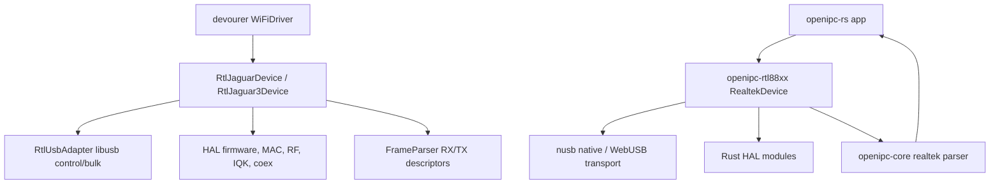

# Devourer Parity Audit

This page tracks the driver-level audit against the current `devourer` tree.
The goal is practical parity: `openipc-rs` should issue the same class of USB,
firmware, MAC, RF, RX, and TX operations while keeping a Rust-native API and
using `nusb` instead of libusb directly.

The reference commit used for this pass was:

```text
OpenIPC/devourer 011f7d3 Jaguar3 (RTL8822CU / RTL8812CU) userspace port (#102)
```

## Audit Plan

The risky parts of this rewrite are the places where small byte/register
differences do not fail at compile time. This is the checklist used for each
chip family:

| Area                 | What to compare                                                                   | Rust location                                            | Failure mode                                   |
| -------------------- | --------------------------------------------------------------------------------- | -------------------------------------------------------- | ---------------------------------------------- |
| USB discovery        | VID/PID table, interface claim, endpoint selection, endpoint override             | `openipc-rtl88xx::SUPPORTED_DEVICES`, `RealtekDevice`    | wrong adapter, wrong bulk OUT endpoint, no TX  |
| Control transfer ABI | Realtek vendor request, register width, endian order                              | `async_driver.rs`, `device.rs`                           | reads look plausible but write wrong registers |
| Firmware load        | power-on state, chunking, reserved-page/DDMA flow, firmware-ready polls           | `async_firmware*.rs`, `async_jaguar3.rs`                 | warm-start works, cold-plug fails              |
| MAC setup            | queue/FIFO, DMA, RX engine, WMAC options                                          | `async_mac.rs`, `async_jaguar3.rs`                       | no bulk-IN frames or FIFO stalls               |
| EFUSE/RFE            | logical-map decoding, RFE pinmux/table choices, TX power data                     | `async_efuse.rs`, `async_tables.rs`, `async_tx_power.rs` | works on one dongle revision, fails on another |
| PHY/RF tables        | table data, conditional opcodes, pseudo-delay entries, write order                | `rtl_data.rs`, `data/*`, table loaders                   | no RX sensitivity, wrong band, unstable TX     |
| Channel/BW           | RF18 band bits, SCO, DFIR, 5/10 MHz reclock, 40/80 fallback behavior              | `async_radio.rs`, `async_jaguar3.rs`                     | tuned to the wrong channel or sample rate      |
| RX descriptors       | field offsets, packet/C2H split, drvinfo/shift offset, 8-byte aggregate alignment | `openipc-core::realtek`                                  | corrupted 802.11 frames or missed C2H reports  |
| TX descriptors       | radiotap RATE/MCS/VHT parsing, 5 GHz CCK clamp, descriptor checksum               | `openipc-rtl88xx::tx`                                    | bulk OUT succeeds but nothing goes on-air      |
| Runtime polling      | coex keepalive, thermal power tracking, PHYDM/watchdog hooks                      | app-owned RX loop plus explicit driver APIs              | sustained TX degrades or stops                 |
| Shutdown             | stop TRX, close RX filter, power-off sequence                                     | `shutdown_monitor*`                                      | adapter wedges until unplug/replug             |

## Current Mapping



`openipc-rs` deliberately does not copy devourer's class layout. The important
boundaries are:

- `openipc-rtl88xx` owns USB, registers, firmware, RF, TX descriptor building,
  diagnostics, and explicit runtime hooks.
- `openipc-core` owns byte-level RX aggregate parsing plus WFB/RTP/FEC payload
  handling.
- apps own scheduling: receive loops, periodic diagnostics, WebUSB UI timing,
  and Tauri worker threads.

## Executed Checks

### Jaguar3 RTL8812CU / RTL8822CU

The current Rust driver includes the new devourer Jaguar3 work:

- PIDs `0bda:c812`, `0bda:c82c`, and `0bda:c82e`.
- 24-byte Jaguar3 RX descriptor layout with packet length, CRC/ICV flags,
  driver-info size, shift size, RX rate, and C2H report bit.
- 48-byte Jaguar3 TX descriptor layout, including the 16-bit descriptor
  checksum algorithm from `cal_txdesc_chksum_8822c`.
- Firmware, MAC, USB, BB/AGC/RF, RFK, DACK, IQK, beamforming setup, monitor RX
  filters, TX path enable, WiFi-only coex setup, H2C keepalives, and thermal
  power/LCK tracking.
- 5 MHz and 10 MHz narrowband retiming on top of 20 MHz channel tuning.
- 40/80 MHz requests degrade to the 20 MHz path for Jaguar3, matching
  devourer's current behavior rather than pretending those modes are fully
  ported.
- TX power override writes the same flat TXAGC reference class used by
  devourer for monitor inject/adaptive-link experiments.
- Clean shutdown now mirrors devourer `Stop()`: halt TRX through `CR`, close
  `RCR`, then run the 8822C card-disable power sequence.

Regression tests now lock several high-risk bytes:

- Jaguar3 RX descriptor field positions and payload offset after drvinfo/shift.
- C2H report detection through descriptor word2 bit 28.
- Jaguar3 TX descriptor field offsets.
- 8822C TX descriptor checksum recomputation.
- 5 GHz CCK-rate requests clamped to OFDM before descriptor encoding.

### Jaguar1 RTL8812AU / RTL8821AU / RTL8814AU

The Rust code tracks the devourer behavior that matters for OpenIPC use:

- supported Realtek/OEM VID/PID discovery,
- firmware load and MAC/RF bring-up,
- RFE-aware table selection,
- EFUSE TX power data,
- monitor filters and RX aggregate parsing,
- radiotap-driven TX descriptor building,
- RTL8814 firmware mode/chunk controls,
- RTL8812/RTL8814 IQK,
- RTL8812 power tracking,
- PHYDM false-alarm/DIG watchdog hooks,
- C2H and RTL8814 TX-status report surfacing.

The Rust crate keeps these as explicit APIs. The app decides whether they run
in a native worker thread, a Tauri command, a browser loop, or a Web Worker.

## Why App-Owned Polling

Devourer is a native process and can create background threads around libusb.
`openipc-rs` is also a library for browsers and Tauri. A hidden polling thread
inside the driver would not map cleanly to WebUSB and would make app shutdown
harder to reason about.

For Jaguar3, devourer's coex thread does two jobs:

1. drain firmware C2H reports from bulk-IN;
2. every roughly two seconds, re-apply 5 GHz coex, power tracking, and H2C
   heartbeats.

OpenIPC Station already keeps bulk-IN transfers posted in its RX loop. The app
also calls `run_jaguar3_coex_keepalive` and `tick_power_tracking_8822c` on a
two-second cadence. The driver exposes the hooks; the app owns scheduling.

## Test Strategy

No test can prove RF without hardware, but the repo should catch translation
drift early:

- unit tests for descriptor bit positions and checksums,
- parser tests for aggregate alignment, malformed lengths, C2H reports,
  C2H metadata offsets, bad-FCS flags, and PHY-status boundaries,
- firmware-header tests for the chip-family signatures and RTL8814 64-byte
  reserved-page header path,
- TX tests for chip-family descriptor selection, checksum calculation, VHT
  rate/PHY flags, 5 GHz CCK clamping, and payload-size rejection,
- radio-channel tests for the 40/80 MHz center-channel mappings used by
  devourer and aviateur,
- fake USB control-transport tests for retrying native register reads/writes
  after stalls or cancelled transfers while failing fast on disconnect,
- recovery-classifier tests for transient stalls/timeouts versus fatal USB
  errors,
- generated-table sanity tests for known table lengths and boundary values,
- protocol tests for WFB session/decrypt/FEC behavior,
- optional PixelPilot/zfex reference tests for FEC parity when the fixture path
  is available,
- real-device cold-plug runs for each supported chip family,
- register-trace comparison against devourer for cold start and channel switch,
- sustained RX/TX tests with adaptive-link enabled.

The hardware tests are still required before claiming a specific adapter model
is proven. Matching source code and byte-level tests greatly reduce risk, but
they do not replace checking real USB timing, EFUSE variants, and RF behavior.

## Remaining Validation Boundary

The implementation is standalone and does not link devourer. The current audit
found one concrete parity gap and fixed it: Jaguar3 shutdown/deinit. The
remaining boundary is hardware proof:

- cold-plug RTL8812AU, RTL8821AU, RTL8814AU, RTL8812CU, and RTL8822CU runs,
- register traces for init, channel switch, and shutdown,
- sustained WebUSB receive,
- sustained native/WebUSB adaptive TX,
- adapter matrix across Linux, macOS, Windows, Android, and browser WebUSB.
