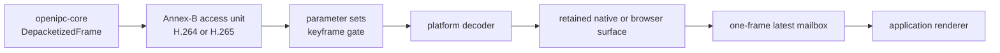

# Platform Video Decoding

`openipc-video` sits between `openipc-core` and an application's renderer. It
accepts complete Annex-B H.264/H.265 access units and returns a retained output
from the decoder provided by the current platform.

| Target  | Rust type        | Decoder                       | Retained output                             |
| ------- | ---------------- | ----------------------------- | ------------------------------------------- |
| macOS   | `MacOsDecoder`   | VideoToolbox                  | IOSurface-backed `CVPixelBuffer`            |
| Linux   | `LinuxDecoder`   | `cros-codecs` + VA-API        | GBM/DMA-backed frame                        |
| Windows | `WindowsDecoder` | Media Foundation + DXVA/D3D11 | `ID3D11Texture2D` subresource               |
| Android | `AndroidDecoder` | NDK MediaCodec                | `AImage` with an acquired `AHardwareBuffer` |
| Web     | `WebDecoder`     | WebCodecs                     | browser `VideoFrame`                        |

`PlatformDecoder` is an alias for the matching row. Target dependencies are
selected with Cargo `cfg` sections, so a macOS app does not build VA-API,
Media Foundation, MediaCodec, or WebCodecs bindings. The crate does not use
FFmpeg or GStreamer.

Linux and Windows currently expose H.265 Main 8-bit/NV12 output. A P010 surface
path is still required before those two backends can advertise Main10. Android,
macOS, and WebCodecs negotiate platform output according to device support.

OpenIPC Station currently calls WebCodecs from its React frontend. Rust/WASM
apps can use `WebDecoder` directly; both routes keep decoded pixels inside the
browser decoder rather than copying them through WASM memory.



## Basic Use

```toml
[dependencies]
openipc-core = "0.1"
openipc-video = "0.1"
```

```rust,no_run
use openipc_video::{PlatformDecoder, VideoDecoder};

# #[cfg(any(
#     target_os = "macos",
#     target_os = "linux",
#     target_os = "windows",
#     target_os = "android",
#     all(target_arch = "wasm32", target_os = "unknown"),
# ))]
# fn handle(frame: openipc_core::DepacketizedFrame) -> Result<(), Box<dyn std::error::Error>> {
let mut decoder = PlatformDecoder::new(Default::default())?;
let outcome = decoder.submit(frame.into())?;
println!("submit: {outcome:?}");

if let Some(frame) = decoder.latest_frame() {
    let size = frame.dimensions();
    println!("{}x{}", size.width, size.height);
    // Keep `frame` alive until the renderer is finished with its surface.
}
# Ok(())
# }
```

Converting `openipc_core::DepacketizedFrame` moves its encoded bytes into
`bytes::Bytes`. It does not base64-encode data or copy decoded pixels.

## Decoder State

`CodecConfigTracker` recognizes:

| Codec | Configuration NAL units | Random-access NAL units     |
| ----- | ----------------------- | --------------------------- |
| H.264 | SPS 7, PPS 8            | IDR 5                       |
| H.265 | VPS 32, SPS 33, PPS 34  | BLA, IDR, CRA 16 through 21 |

Parameter sets may arrive together or across several access units. The SPS is
parsed once a complete configuration exists to obtain coded size, visible size,
bit depth, and an RFC 6381 codec string. Decode starts only after a random-access
frame. A changed parameter set rebuilds the platform session and re-enters the
keyframe gate.

This matters when a receiver joins an active flight: a fresh decoder cannot
produce a valid picture from a delta frame, even if RTP/WFB delivery succeeded.

## Latency And Backpressure

The defaults are intended for live FPV:

```rust
use openipc_video::DecoderOptions;

let options = DecoderOptions {
    max_frames_in_flight: 3,
    low_latency: true,
    require_hardware: true,
};
```

The input limit bounds work owned by the platform decoder. Output has a
single-slot mailbox. When rendering is late, a new decoded frame replaces the
old pending output rather than growing a stale playback queue.

`require_hardware` is strict on platforms that can classify decoders. Android
API 26 does not expose that classification through NDK MediaCodec, and
WebCodecs exposes `prefer-hardware` rather than a guarantee; those backends make
the request but leave final selection to the operating system/browser.

`DecoderStats` includes received/submitted access units, configuration and
keyframe waits, backpressure drops, replaced outputs, decode errors, current
in-flight depth, and last/maximum submit-to-output latency.

## Scheduling And Ownership

Construct and drive a decoder from one receive/decode task. Poll
`latest_frame` after submissions or from the render tick. Move or clone only the
retained output according to that target's rules.

- VideoToolbox completes on framework queues. macOS outputs are `Send + Sync`.
- The VA-API display is thread-affine. Construct and drive `LinuxDecoder` in
  its worker; retained Linux outputs are `Send + Sync`.
- Keep the Media Foundation transform on its creating worker. Retained D3D11
  outputs are `Send + Sync`.
- Keep Android `AImage` leases on the app's chosen decode/render threads and do
  not hold more frames than the configured image limit. A frame may move
  between those threads under exclusive ownership; concurrent access to one
  frame is not supported.
- `WebDecoder` and `WebVideoFrame` are local-executor values because browser
  objects are not Rust `Send` types. Let the browser event loop run between
  submissions and output polls.

For egui, a native decode worker can replace an `Arc`/channel slot and call
`Context::request_repaint()` whenever a newer frame arrives. On the web, an
eframe integration should poll from its local animation/render loop.

## macOS: VideoToolbox

VideoToolbox receives four-byte length-prefixed NAL units, so this backend
converts Annex-B immediately before creating its CoreMedia sample. It requests
Metal-compatible, IOSurface-backed NV12 output.

Import `MacOsVideoFrame::pixel_buffer()` through a `CVMetalTextureCache` made
from the renderer's Metal device: plane 0 is `R8Unorm` luma and plane 1 is
`RG8Unorm` interleaved chroma. Keep the frame alive through draw.

## Linux: VA-API

The Linux backend uses `cros-codecs` stateless H.264/H.265 decoders and a
VA-API display opened from a DRM render node. GBM output buffers are recycled
through a bounded pool only after the application drops its retained frame.

`LinuxVideoFrame` exposes DRM FourCC, plane pitches/sizes, and
`with_mapped_planes()` for temporary CPU access. `cros-codecs` 0.0.6 does not
yet expose the DMA-BUF file descriptors of `GenericDmaVideoFrame`, so direct
wgpu DMA-BUF import must wait for that upstream handle; mapping still avoids a
software decode or intermediate color conversion.

The backend checks `/dev/dri/renderD128` through `renderD143`. Select one with
`OPENIPC_VAAPI_DEVICE=/dev/dri/renderD129`.

Debian/Ubuntu build packages:

```sh
sudo apt-get install clang libclang-dev libdrm-dev libgbm-dev libva-dev pkg-config
```

## Windows: Media Foundation

The Windows backend creates a video-capable D3D11 device and shares it with a
D3D11-aware Media Foundation transform through `IMFDXGIDeviceManager`.

`WindowsVideoFrame::texture()` returns a retained `ID3D11Texture2D`; use
`subresource_index()` because decoder output often occupies a texture-array
slice. Keep the frame alive through GPU submission because its retained
`IMFSample` controls when Media Foundation may recycle that surface.

`WindowsDecoder::d3d_device()` exposes the matching device and `decoder_name()`
reports the active transform after configuration.

For renderers without D3D11 texture import,
`WindowsVideoFrame::copy_nv12()` copies the selected texture-array slice into
tightly packed NV12 planes. Decoder frames share a resolution-matched staging
texture, so repeated readback does not allocate a D3D11 resource per frame.

## Android: MediaCodec

The Android backend requires API 26 or newer. It configures NDK MediaCodec with
H.264 `csd-0`/`csd-1` or an H.265 `csd-0`, and sends decoded output to a
flexible YUV 4:2:0 `AImageReader` surface with CPU-read and GPU-sampled usage.
Devices that reject the combined usage fall back to CPU-readable YUV output.

`AndroidVideoFrame` owns both the `AImage` lease and an acquired
`AHardwareBufferRef`. Import `hardware_buffer()` through EGL/OpenGL ES, Vulkan,
or another compatible renderer. The buffer remains valid until the Rust frame
is dropped. `timestamp_ns()` carries MediaCodec's presentation timestamp and
`native_format()` identifies the hardware-buffer format.

Set an Android app's minimum SDK to at least 26 before linking this backend.
MediaCodec's system-selected decoder may still be software on unusual devices;
the API level used here cannot query a reliable hardware classification.

## Web: WebCodecs

The WASM backend uses the Rust `web-codecs` bindings. It configures Annex-B
mode, prepends cached parameter sets to the first keyframe after every reset,
passes `optimizeForLatency`, and requests hardware acceleration when enabled.

The API is only available in browsers that expose `VideoDecoder` and
`EncodedVideoChunk`, normally in a secure context. API presence does not prove
a particular H.265 profile is available. Once parameter sets have arrived, ask
the browser about the exact stream:

```rust,no_run
# #[cfg(all(target_arch = "wasm32", target_os = "unknown"))]
# async fn supported(config: &openipc_video::CodecConfig) -> Result<bool, openipc_video::VideoError> {
use openipc_video::{DecoderOptions, WebDecoder};

WebDecoder::is_config_supported(config, DecoderOptions::default()).await
# }
```

`WebVideoFrame::video_frame()` borrows the browser frame for direct rendering.
`clone_video_frame()` creates a separately owned handle for JavaScript; that
owner must close it. Dropping the Rust surface closes its own frame.

The common synchronous `flush()` is a low-latency reset that closes and
discards queued work. `WebDecoder::flush_async().await` first awaits accepted
chunks and drains their outputs, which is useful before completing a recording.

## Build And Validate

Run shared and host tests:

```sh
cargo test -p openipc-video --all-targets
cargo clippy -p openipc-video --all-targets --no-deps -- -D warnings
```

Compile the mobile and browser implementations:

```sh
rustup target add aarch64-linux-android wasm32-unknown-unknown
cargo clippy -p openipc-video --target aarch64-linux-android --all-targets --no-deps -- -D warnings
cargo clippy -p openipc-video --target wasm32-unknown-unknown --all-targets --no-deps -- -D warnings
```

Inspect or decode a complete access unit on desktop:

```sh
cargo run -p openipc-video --example inspect_annex_b -- h265 idr.h265
cargo run -p openipc-video --example decode_access_unit -- h265 idr.h265
```

Cross-target compilation verifies API and ownership constraints. Pixel output,
codec selection, and GPU import still require runtime tests on each OS/device
and browser.
