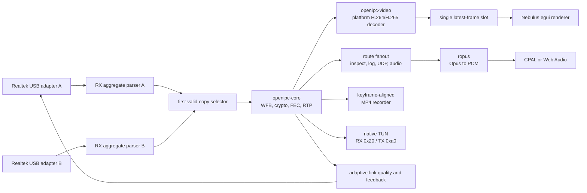

# Nebulus

Nebulus is the workspace's pure-Rust ground station. It is built with egui and
targets macOS, Linux, Windows, Android, and browsers from one application
crate. Use it when you want a native Rust UI or a compact reference showing how
the driver, protocol, and decoder crates fit together.

Nebulus is the project's primary ground station. It provides the low-latency
video receive path, adaptive link, configurable payload routes, Opus playback,
encoded recording, native VPN bridging, diagnostics, and a portable all-Rust
UI. The older React/Tauri OpenIPC Station remains in the repository as an
alternative implementation. New desktop and Android release artifacts, and the
hosted app at [nebulus.openipc-rs.neels.dev](https://nebulus.openipc-rs.neels.dev),
are built from Nebulus. The older React app remains available at its own legacy
URL.

The header always shows the package version. CI builds also embed the current
tag and short commit hash from the same `OPENIPC_*` metadata used by Station.

## Architecture



The desktop and Android app keep one blocking USB capture worker per selected
adapter and one shared protocol/decode worker. Each radio keeps four bulk-IN
transfers in flight. The shared worker selects unique WFB packets, advances the receiver state machine,
submits complete access units to the decoder, and sends compact state updates
to egui. The UI thread never waits on USB or codec work.

The browser follows the same stages and races one completion future per
authorized adapter on the browser's local async executor.
WebUSB and WebCodecs objects cannot cross Rust threads, so Nebulus polls them
without a Web Worker. Every asynchronous completion requests an egui repaint;
the UI does not busy-loop while idle.

## Platform Boundaries

| Target  | USB access                                 | Video decode                   | Audio output   |
| ------- | ------------------------------------------ | ------------------------------ | -------------- |
| macOS   | `nusb`                                     | VideoToolbox                   | CPAL/CoreAudio |
| Linux   | `nusb`                                     | VA-API through `cros-codecs`   | CPAL/ALSA      |
| Windows | `nusb`                                     | Media Foundation and D3D11     | CPAL/WASAPI    |
| Android | `UsbManager`, then `nusb::Device::from_fd` | MediaCodec to SurfaceTexture   | CPAL/AAudio    |
| Browser | `nusb-webusb` / WebUSB                     | WebCodecs                      | Web Audio      |

Android's JNI bridge only handles discovery, permission, and opening the USB
file descriptor. Radio control transfers and streaming transfers are still
performed by the Rust driver.

## Desktop

From the repository root:

```sh
cargo run -p nebulus --bin nebulus --release
```

After a release is published to crates.io, a source install is also available:

```sh
cargo install nebulus
nebulus
```

Prebuilt packages are available from
[GitHub Releases](https://github.com/neelsani/openipc-rs/releases): Linux
executables, macOS `.dmg` images, Windows installer `.exe` files, and a
universal Android APK. Platform security warnings are expected until
notarization and code signing are configured.

### System Tray

macOS and Windows builds install a Nebulus tray icon. It appears in the macOS
menu bar or the Windows notification area; Windows may move it under the
overflow arrow. The menu provides:

- **Show Nebulus** and **Hide Nebulus**,
- **Start RX** or **Stop RX**, synchronized with receiver state,
- **Enable VPN on next start**, available while the receiver is stopped,
- **Open VPN Settings**, which restores the window and selects the VPN panel,
- **Quit Nebulus**.

VPN cannot be enabled in the middle of an active receiver session because its
WFB tunnel routes and native TUN interface are constructed during startup. Stop
RX, enable VPN from either the tray or VPN panel, then start RX again. Linux
does not currently build the tray integration, avoiding additional
AppIndicator/GTK runtime dependencies.

Select a primary adapter and optional diversity receivers, set the radio channel and width to match the VTX,
confirm the WFB key, and press **Start RX**. The default OpenIPC `gs.key` is
embedded. **Open file** uses the native desktop dialog, browser picker, or
Android Storage Access Framework to load another key. The key is never text
editable. Dropping a `gs.key` file on the window remains available where the
platform supports file drops. Channel, offset, and Link ID use bounded sliders
with individual buttons that restore OpenIPC defaults.

### Profiles

The Profiles section stores named receiver configurations. Each profile
contains the primary and diversity adapters, RF channel/width/offset, Link ID, minimum epoch,
WFB key, decoder preference, RTP reorder setting, adaptive-link settings,
payload routes, audio volume, transfer size, and VPN state. Theme, UI scale,
log verbosity, sidebar visibility, and HUD layout remain global.

### Receive Diversity

Every selected adapter is tuned identically. CRC/ICV-valid packets are merged
before WFB decryption and FEC, with the first copy forwarded immediately. The
primary adapter alone handles adaptive-link and VPN uplink. Diagnostics reports
per-radio signal, USB health, first-copy wins, and duplicates. Browser users
must press **Add adapter** once per radio to grant WebUSB permission. See
[Receive Diversity](./receive-diversity.md) for topology guidance and library
integration details.

Selecting a profile applies its saved snapshot. Editing controls does not
silently overwrite that snapshot; use **Save current** when the new values
should become the profile. **New** copies the values currently on screen and
**Delete** removes the active profile. At least one profile is retained.

### Preflight

**Run preflight** opens a report without touching the adapter. It validates:

- selected-device visibility,
- WFB key structure,
- channel, width, offset, and Link ID ranges,
- duplicate or invalid route definitions,
- browser-incompatible UDP routes,
- VPN/TUN availability,
- adaptive-link state,
- known decoder capabilities from the current session.

A failed check disables **Start RX** in the report. Warnings identify optional
or connect-time checks and do not block startup. The normal Start RX button is
still available for operators who intentionally need to test an unusual setup.

### Channel Scanner

**Scan channels** opens an idle survey and cannot run alongside RX. Select a
2.4 GHz or 5 GHz preset, individual channels, and a dwell time. Nebulus performs
one monitor-mode initialization, keeps bulk-IN transfers active, and uses the
driver's retune operation between dwell windows. Each result includes valid
802.11 packet count, recognized WFB frame count, average RSSI by RF path,
captured bytes, and the corresponding observed bitrate. **Use** copies a result
back into the active radio settings.

The scanner is a receiver-side observation, not a spectrum analyzer. Packet
counts only cover traffic the adapter can demodulate. A strong WFB count is a
useful way to locate an active VTX; a zero count does not prove a channel is
free of RF energy. The driver always runs monitor shutdown after a completed or
failed survey.

Once monitor initialization succeeds, the top of Settings shows the connected
receiver's actual USB VID:PID, probed chip family, RF path layout, cut revision,
USB connection speed, bulk endpoints, cold/warm initialization result, firmware
download status, and active RF and video-channel configuration. These values
come from the opened device and `InitReport`, not the selector's family hint.
Nebulus clears the summary on stop or failure so it never looks like a stale
device is still connected.

The Linux decoder requires VA-API development packages. See
[Platform Video Decoding](./native-video.md#linux-va-api) for the package list
and render-node override.

## Browser

```sh
rustup target add wasm32-unknown-unknown
cargo install trunk --locked
cd apps/nebulus
trunk serve --release --open
```

WebUSB requires localhost or HTTPS. **Start RX** opens the picker for an empty
configuration, while **Add adapter** authorizes additional radios one at a
time. Both calls happen directly inside the click handler to preserve the
browser's user gesture. Every selected device is initialized into monitor mode
by the same Rust HAL used by native targets.

To build static deployment files:

```sh
cd apps/nebulus
trunk build --release
```

Serve the generated `dist/` directory over HTTPS. Do not open `index.html`
directly from disk; WebUSB is unavailable from a `file:` origin.

Run `trunk serve` without `--release` to expose the development-only
**Codec mock** button. The same button is available from a debug native build
started with `cargo run -p nebulus --bin nebulus`. It loops an embedded,
pre-recorded 1920x1080 H.264 stream with 48 kHz Opus audio. Rust packetizes and
interleaves both tracks as RTP. Video runs through the normal depacketizer and
production decode/presentation path; audio runs through the configured
mixed-audio route, Opus decoder, volume control, and output queue. WASM uses
WebCodecs only for video decoding; the mock does not use an encoder. It requires
no USB adapter and is omitted from release builds.

## Android

Nebulus uses Android NativeActivity and declares USB-host support through
Cargo APK metadata.

```sh
./scripts/android-nebulus-dev.sh
```

The helper discovers Java, the Android SDK, and the newest installed NDK. It
starts the first available AVD or reuses a running emulator, waits for boot,
maps the emulator ABI to the correct Rust target, installs Nebulus, and follows
timestamped Logcat output. Select an AVD or force a clean boot with:

```sh
./scripts/android-nebulus-dev.sh --avd openipc_pixel_8_api36 --cold-boot
```

For an APK-only build:

```sh
rustup target add aarch64-linux-android
cargo install cargo-apk2 --locked
cargo apk2 build -p nebulus --lib --target aarch64-linux-android
```

On first start, Android displays its USB permission prompt after the user
starts the receiver. The app keeps the `UsbDeviceConnection` alive for the
whole receiver session and gives a duplicated descriptor to `nusb`, avoiding a
second Java/Kotlin data path.

The Android entrypoint installs Nebulus's shared Rust logger, so driver and
application messages are available in standard application output and the
in-app Logs tab.

eframe storage is explicitly rooted in Android's internal app-data directory.
Profiles, the key, route definitions, HUD positions, and GUI settings survive
activity recreation and process restarts without requesting broad filesystem
permission. Clearing application storage resets them. File imports and support
bundle exports use Android's Storage Access Framework.

The default build uses Android's debug key. A distribution build additionally
needs a release keystore configured through
`[package.metadata.android.signing.release]`; do not commit keystore passwords
to the repository.

## Latency Behavior

Nebulus favors current video over complete playback:

- Four USB reads remain in flight to avoid endpoint starvation.
- WFB FEC and optional RTP reorder happen before decode.
- Decoder work uses a small, platform-bounded in-flight queue.
- Decoded output is a single-slot latest-frame mailbox.
- Runtime events coalesce pending video to one frame and merge pending batch
  counters, so a slow UI cannot build a decoded-frame queue.
- egui presents only the newest output available after a receive batch.
- The receiver thread calls `Context::request_repaint()` when new state or a
  frame is ready.

On macOS, Linux, and Windows, the receiver hands retained native decoder
surfaces to the UI through a latest-only event slot. Stale surfaces are
dropped before presentation work begins. The UI uploads the newest frame's Y
and UV planes into persistent `R8Unorm` and `Rg8Unorm` wgpu textures and
converts them in a GPU fragment shader. This reduces a 1080p upload from about
8.3 MB of RGBA to 3.1 MB of NV12 and removes per-pixel CPU color conversion.

VideoToolbox exposes mapped NV12 planes on macOS. Linux maps the selected
VA-API DMA surface only after coalescing. Windows retains the Media Foundation
D3D11 texture through coalescing, reuses one resolution-matched staging
texture for readback, and then uploads NV12. The CPU RGBA presenter remains a
failure fallback. Stable wgpu does not currently expose portable IOSurface,
DMA-BUF, or D3D11 texture import; those imports are the remaining route to a
fully zero-copy presentation path.

Android uses `AndroidSurfaceDecoder` and gives MediaCodec a SurfaceTexture
producer window. MediaCodec renders decoded output into the external OES
texture; the egui Glow callback calls `updateTexImage`, applies Android's texture
transform, and samples that texture directly. There is no `AImageReader`, YUV
plane mapping, CPU color conversion, or per-frame GPU upload in Nebulus's
Android display path. The library's separate `AndroidDecoder` remains available
to applications that need readable `AImage`/`AHardwareBuffer` output.

Browser builds retain the WebCodecs `VideoFrame` through the latest-only
event queue and use WebGL's native `VideoFrame` texture upload. There is no
`copyTo(RGBA)`, JavaScript pixel array, or decoded-frame copy across the WASM
boundary. The persistent texture is updated in place when resolution is
unchanged.

## Payload Routes And Audio

The Routes tab configures application outputs without changing protocol
parsing in `openipc-core`. A route has a stable numeric ID, a radio port under
the current Link ID, and one action:

| Action      | Behavior                                                               |
| ----------- | ---------------------------------------------------------------------- |
| Inspect     | Counts recovered payloads and bytes without parsing them.              |
| Log         | Adds a rate-limited size, sequence, and hexadecimal preview to Logs.   |
| Audio       | Selects an RTP payload type, decodes Opus with `ropus`, and plays PCM. |
| UDP forward | Sends the unchanged recovered payload to a native UDP destination.     |

UDP is unavailable in browsers and cannot be enabled there. The default routes
match Station: telemetry on `0x10`, mixed RTP audio on video port `0x00` using
payload type 98, and a disabled data route on `0x20`. A separate transmitter
audio profile can instead be selected with audio port `0x30`.

Routes using the same channel and key slot share one `PayloadPipeline`. Mixed
audio therefore shares video's WFB session, decryption, and FEC state; only the
matching RTP payload is copied into the audio action. Route topology, ports,
actions, and codec settings are locked while receiving and apply on the next
start. Output volume remains adjustable during reception and updates every
active audio route on the next packet on native, Android, and Web builds.

## Diagnostics

The Metrics tab keeps six operational signals over a rolling window: best-path
link score, unrecoverable post-FEC loss, the percentage of damaged primary
packets repaired by FEC, encoded video bitrate, delivered video FPS, and local
receive-through-decode processing latency. Loss and FEC percentages use deltas
from each sampling interval rather than lifetime counters. RSSI/SNR remain in
the video OSD and audio queue/counter details remain with route diagnostics.
Plots disable dragging, zooming, wheel navigation, and double-click reset; their
bounds follow the newest retained samples.
Diagnostics is divided into four views:

- **Pipeline health** follows USB initialization, 802.11 parsing, WFB recovery,
  RTP arrival, codec configuration, decoding, audio, and VPN state.
- **RTP** exposes payload/NAL type, sequence and timestamp, codec parameter-set
  state, malformed and unsupported packets, fragment gaps, config-wait drops,
  and reorder-buffer counters.
- **Stage latency** keeps rolling last, average, p95, maximum, and sample count
  values for USB wait, Realtek parsing, WFB/RTP, routes, decoder submission,
  hardware decode, and the complete receive batch.
- **Environment** reports target OS and architecture, runtime, renderer, USB
  API, media backend, H.264/H.265 availability and acceleration status, native
  surface support, logical processors, browser user agent where applicable,
  and the maximum resolution/FPS observed in the current session. Platform
  decoder APIs do not expose a reliable global maximum on every target, so
  observed limits are labeled as such.

The Logs tab owns capture verbosity: Low, Normal, High, or Very verbose. It also
has an independent minimum-level display filter and target/message search. Logs
remain bounded to avoid memory growth.

**Export support bundle** writes a ZIP containing `report.json`, `logs.txt`,
and a short README. The report captures the build tag/commit, platform and
decoder capabilities, selected receiver configuration, sanitized profile and
route summaries, hardware identity, packet/FEC/RTP/audio/VPN metrics, recovery
state, and the latest channel-scan results. Home-directory paths in logs are
shortened. Key bytes are never included; the report records only key length and
whether the active key is the built-in default. Desktop uses a save dialog,
Android uses the document picker, and the browser downloads the ZIP.

## GUI Settings

The GUI tab keeps appearance controls separate from receiver and codec
configuration. Settings apply immediately and persist through eframe storage:

- **Theme** selects Catppuccin Latte, Frappé, Macchiato, or Mocha. Latte is the
  light palette; the other three are dark palettes.
- **Interface scale** adjusts the complete interface from 75% to 150% in 5%
  increments without changing decoded video resolution.
- **Link telemetry overlay** controls the ground-station video HUD.
- **Edit video HUD** opens a 16:9 preview. Each value can be dragged to a
  normalized video position, hidden, scaled, or given a different background
  opacity. The default layout places resolution, FPS, bitrate, local latency,
  RSSI, packet loss, and link score along the lower edge. Positions are clamped
  to the visible video on small screens.
- **Controls panel visible** hides or restores the side/bottom controls. The
  header's **Controls** button always remains available to restore it.
- **Reset GUI settings** restores Macchiato, 100% scale, the telemetry overlay,
  and a visible controls panel.

These options are shared by desktop, Android, and browser builds. They do not
change radio initialization, WFB processing, decoder selection, or recording
output.

## Recording

Nebulus records the original encoded H.264/H.265 access units before decode and
muxes them into an `.mp4` file. It does not decode and re-encode the picture, so
recording does not reduce quality or add an encoder to the receive path. The
recorder arms immediately and begins at the next keyframe. Codec parameter sets
and dimensions are read from that access unit, while RTP timestamps supply the
MP4 sample timing.

The first enabled audio route is also recorded when it carries Opus RTP. The
recorder strips the RTP header and writes each raw Opus packet to the MP4 audio
track using Opus's fixed 48 kHz RTP clock and the route's channel count. Video
and audio each retain their own RTP timing; recording begins both timelines at the first media
captured after the keyframe because the receiver has no RTCP clock mapping.

Native muxing runs on a bounded worker so filesystem and container work stay out
of the USB/decode loop. Browser recordings are assembled and downloaded when
recording stops. Both targets cap retained encoded media at 512 MiB. Each
depacketized video access unit becomes exactly one MP4 sample, preserving
multi-slice pictures and RTP's 90 kHz timing.

## VPN / TUN

On macOS, Linux, Windows, and Android, the VPN tab can create a native
layer-three interface at `10.5.0.3/24` when RX starts. Downlink payloads recovered on radio
port `0x20` are length-decoded and written to TUN. Uplink IP packets are
length-prefixed, passed through `WfbTransmitter`, and injected by
`openipc-rtl88xx` on radio port `0xa0`. The transmitter refreshes its WFB
session packet once per second and drains at most 32 queued packets per receive
iteration to keep video work bounded.

VPN is unavailable in browser builds because browsers cannot create an OS
network interface or send arbitrary UDP/IP packets. Android uses a small
`VpnService` solely for user consent and TUN creation. Its descriptor is
duplicated into `rust-tun`; packet transport, WFB wrapping, and Realtek
injection remain in Rust.

Windows uses Wintun. GitHub release installers place the architecture-matched
DLL beside Nebulus. When a Cargo installation has no DLL, the VPN tab shows an
**Install Wintun** button and download progress. Nebulus fetches the official
[Wintun 0.14.1 archive](https://www.wintun.net/), verifies the published
SHA-256 before extraction, and writes the DLL and its license to
`%LOCALAPPDATA%\Nebulus\wintun\0.14.1`. The install controls disappear as soon
as the verified DLL is ready, and failed downloads can be retried.

Adaptive link does not require a TUN interface or Wintun. Its quality report is
wrapped as IPv4/UDP by `openipc-core`, encrypted and FEC-framed for radio port
`0xa0`, then submitted directly to the Realtek TX worker. Enabling VPN merely
adds general-purpose IP downlink/uplink bridging on ports `0x20` and `0xa0`.

Malformed USB aggregates and recoverable bulk-transfer failures are logged and
skipped. A stalled endpoint is cleared before reads resume. With **Automatically
recover a dropped receiver** enabled, a native receiver that had reached Ready
or Receiving is restarted after bounded exponential delays. A bad initial key,
unsupported decoder, or other first-connect failure is left in the failed state
for operator correction instead of looping. Browser recovery remains manual
because `requestDevice()` requires a user gesture. Backoff state resets after
30 seconds of stable reception, and Stop RX or Cancel immediately clears a
pending retry.

## Validate

```sh
cargo test -p nebulus --all-targets
cargo clippy -p nebulus --all-targets --no-deps -- -D warnings
cargo check -p nebulus --target wasm32-unknown-unknown
cargo check -p nebulus --target aarch64-linux-android --lib
```

Cross-compilation validates target APIs. Actual radio initialization, codec
selection, pixel output, and adaptive-link transmission still need a supported
adapter and VTX for end-to-end validation.
