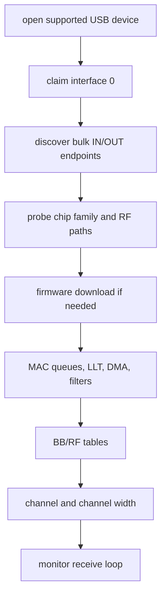

# Realtek Driver

`openipc-rtl88xx` is the shared Rust Realtek USB/HAL driver.

It is not a wrapper around devourer. The code was written from the reference
projects, then split into Rust modules for transport, firmware, MAC setup,
radio setup, RX parsing, TX descriptors, and TX power.

## Supported Device IDs

The current USB ID table is:

| VID:PID | Family Hint | Label |
| --- | --- | --- |
| `0bda:8812` | RTL8812 | RTL8812AU / RTL8811AU reference PID |
| `0bda:0811` | RTL8812 | RTL8811AU |
| `0bda:a811` | RTL8812 | RTL8811AU |
| `0bda:b811` | RTL8812 | RTL8811AU / RTL8821AU variant |
| `0bda:8813` | RTL8814 | RTL8814AU |
| `2357:0120` | RTL8821 | TP-Link Archer T2U Plus / RTL8821AU |

The chip probe still reads hardware state after opening the device. The table is
only the first filter used for discovery.

## Implemented Operations

- descriptor-driven endpoint discovery,
- vendor-control register reads and writes through request `0x05`,
- firmware download for supported Jaguar-family chips,
- LLT/page setup and queue/FIFO setup,
- MAC/BB/RF table loading,
- monitor filters,
- channel and channel-width setup,
- RX bulk reads,
- TX bulk writes for adaptive-link feedback.

## Initialization Shape



Cold start is the hard part. A warm adapter that already has firmware running
can appear to work even when parts of initialization are wrong. Treat cold-plug
testing as the real validation case.

## Native And WebUSB Sharing

The HAL is async and transport-oriented. Native builds use `nusb` for desktop
USB. Browser builds use the WebUSB-capable `nusb-webusb` package after the user
grants the device in JavaScript.

The browser still needs the same Realtek HAL work as native: WebUSB changes how
control and bulk transfers are issued, not what registers or firmware steps the
adapter needs.

## Validation Boundary

The driver does not build against devourer. Hardware bring-up still needs
register-trace comparison and live adapter tests before each supported chip can
be marked final.

Current status:

- RTL8812/RTL8821 cold initialization is implemented and needs live validation.
- RTL8814 reserved-page/DDMA firmware download is implemented and needs live
  validation.
- EFUSE/RFE parsing is still conservative and needs hardware fixtures.

When debugging a new adapter, start with:

```sh
cargo run -p openipc-native -- list-supported
cargo run -p openipc-native -- probe
cargo run -p openipc-native -- recv --key gs.key --rf-channel 161 --max-transfers 100
```
