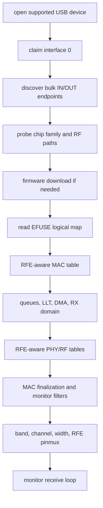

# Realtek Driver

`openipc-rtl88xx` is the shared Rust Realtek USB/HAL driver.

It is not a wrapper around devourer. The code was written from the reference
projects, then split into Rust modules for transport, firmware, MAC setup,
radio setup, RX parsing, TX descriptors, and TX power.

## Supported Device IDs

The source of truth is `SUPPORTED_DEVICES` in the driver crate. The current
table includes the Realtek reference IDs plus the RTL8821AU vendor IDs mirrored
from devourer:

| VID:PID | Family Hint | Label |
| --- | --- | --- |
| `0bda:8812` | RTL8812 | RTL8812AU / RTL8811AU reference PID |
| `0bda:0811` | RTL8812 | RTL8811AU |
| `0bda:a811` | RTL8812 | RTL8811AU |
| `0bda:b811` | RTL8812 | RTL8811AU / RTL8821AU variant |
| `0bda:8813` | RTL8814 | RTL8814AU |
| `0bda:0820` | RTL8821 | RTL8821AU |
| `0bda:0821` | RTL8821 | RTL8821AU |
| `0bda:0823` | RTL8821 | RTL8821AU |
| `0bda:8822` | RTL8821 | RTL8821AU |
| `0411:0242` | RTL8821 | Buffalo RTL8821AU |
| `0411:029b` | RTL8821 | Buffalo RTL8821AU |
| `04bb:0953` | RTL8821 | I-O Data RTL8821AU |
| `056e:4007` | RTL8821 | Elecom RTL8821AU |
| `056e:400e` | RTL8821 | Elecom RTL8821AU |
| `056e:400f` | RTL8821 | Elecom RTL8821AU |
| `0846:9052` | RTL8821 | Netgear RTL8821AU |
| `0e66:0023` | RTL8821 | Hawking RTL8821AU |
| `2001:3314` | RTL8821 | D-Link RTL8821AU |
| `2001:3318` | RTL8821 | D-Link RTL8821AU |
| `2019:ab32` | RTL8821 | Planex RTL8821AU |
| `20f4:804b` | RTL8821 | TRENDnet RTL8821AU |
| `2357:011e` | RTL8821 | TP-Link RTL8821AU |
| `2357:0120` | RTL8821 | TP-Link Archer T2U Plus / RTL8821AU |
| `2357:0122` | RTL8821 | TP-Link RTL8821AU |
| `3823:6249` | RTL8821 | Obihai RTL8821AU |
| `7392:a811` | RTL8821 | Edimax RTL8821AU |
| `7392:a812` | RTL8821 | Edimax RTL8821AU |
| `7392:a813` | RTL8821 | Edimax RTL8821AU |
| `7392:b611` | RTL8821 | Edimax RTL8821AU |

The chip probe still reads hardware state after opening the device. The table is
only the first filter used for discovery.

## Implemented Operations

- descriptor-driven endpoint discovery,
- vendor-control register reads and writes through request `0x05`,
- firmware download for supported Jaguar-family chips,
- EFUSE logical-map parsing for MAC address, RFE type, amplifier flags, TX BB
  swing bytes, thermal baseline, and TX-power PG blocks,
- LLT/page setup and queue/FIFO setup,
- RFE-aware MAC/BB/RF table loading, including conditional RF table opcodes,
- monitor filters,
- channel, channel-width, band-switch, RFE pinmux, and BB-swing setup for
  RTL8812/RTL8821/RTL8814,
- RX bulk reads, including multi-transfer in-flight reads mirroring newer
  devourer's always-posted bulk-IN model,
- C2H packet surfacing, RTL8814 TX-status parsing, and optional corrupted-FCS
  RX packet retention for diagnostics,
- TX bulk writes, TX-mode/radiotap parsing for legacy/HT/VHT injection,
  descriptors, and TX power overrides for adaptive-link feedback,
- devourer-compatible VID/PID targeting, bulk-OUT endpoint override, RTL8814
  firmware path/chunk controls, IQK policy switches, TX-power skip switch, and
  RTL8814 legacy-descriptor escape hatch,
- EFUSE-backed per-rate TXAGC programming, including the newer devourer 8812A
  PG table and regulatory limit table,
- RTL8812 thermal power tracking, RTL8812/RTL8814 IQK paths, and a monitor-mode
  PHYDM false-alarm/DIG watchdog,
- thermal meter, false-alarm counters, RTL8814 queue-depth, BB-register, and
  BB-dbgport diagnostics.

## Initialization Shape



Cold start is the hard part. A warm adapter that already has firmware running
can appear to work even when parts of initialization are wrong. Treat cold-plug
testing as the real validation case.

## Native And WebUSB Sharing

The HAL is async and transport-oriented. Native builds use `nusb` for desktop
USB. Browser builds use the WebUSB-capable `nusb-webusb` package after the user
grants the device in JavaScript.

The browser still needs the same Realtek HAL work as native: WebUSB changes how
control and bulk transfers are issued, not what registers or firmware steps the
adapter needs.

## Runtime Options

Native and browser code use the same two option structs:

- `DriverOptions`: USB reset behavior, VID/PID targeting, and bulk-OUT endpoint
  override.
- `MonitorOptions`: bad-FCS retention, TX-power programming skip, IQK policy,
  and RTL8814 firmware download mode/chunk size.

Native builds additionally read devourer-compatible environment variables:

| Variable | Effect |
| --- | --- |
| `DEVOURER_VID` / `DEVOURER_PID` | Target a specific USB adapter. |
| `DEVOURER_SKIP_RESET` | Skip USB reset before claiming the adapter. |
| `DEVOURER_TX_EP` | Force a bulk-OUT endpoint. |
| `DEVOURER_SKIP_TXPWR` | Skip TX-power table programming during channel set. |
| `DEVOURER_FORCE_IQK` | Run IQK where it is otherwise opt-in, notably RTL8814. |
| `DEVOURER_DISABLE_IQK` | Suppress IQK. |
| `DEVOURER_8814_FWDL=kernel\|rtw88` | Select the RTL8814 firmware path. |
| `DEVOURER_8814_FWDL_CHUNK=<n>` | Override RTL8814 kernel-path chunk size. |
| `DEVOURER_TX_LEGACY_8812_DESC` | Use the older 8812 TX descriptor shape on RTL8814. |

The browser API exposes the same choices with
`WebUsbRealtekDevice.fromWebUsbDeviceWithOptions`,
`initializeMonitorAdvanced`, and `sendPacketWithOptions`.

## Diagnostics Strategy

The Rust driver exposes diagnostics as explicit calls, not background threads.
That is deliberate.

Devourer has native background work because it owns the whole process and can
coordinate that with libusb transfer timing. `openipc-rs` is a library used from
native CLI, Tauri, and browser/WebUSB code. A hidden polling thread in the
driver would be hard to schedule correctly across all three.

Applications should schedule diagnostics at the app boundary:

- native CLI/Tauri can poll from the existing RX loop or an app-owned worker,
- browser apps can use timers, animation frames, or a Web Worker if UI jank
  appears,
- the core driver APIs remain deterministic and testable.

Available explicit hooks include thermal status, false-alarm counters, RTL8814
queue-depth registers, BB register/dbgport reads, PHYDM DIG watchdog ticks,
IQK, RTL8812 power tracking ticks, C2H payloads, and RTL8814 TX-status parsing.

## Validation Boundary

The driver does not build against devourer. Hardware bring-up still needs
register-trace comparison and live adapter tests before each supported chip can
be marked final.

Current status:

- RTL8812/RTL8821 cold initialization, EFUSE-backed RFE selection,
  devourer-style band switching, EFUSE TX power, optional by-rate TX power, and
  regulatory limit handling are implemented and need live validation.
- RTL8814 reserved-page/DDMA firmware download, RFE GPIO pin-select,
  band-specific RFE pinmux, BB swing, and post-firmware MAC writes are
  implemented and need live validation. The default path follows the newer
  devourer kernel-faithful flow; `DEVOURER_8814_FWDL=rtw88` keeps the older
  rtw88-mimic fallback available for A/B testing.
- RTL8812 thermal power tracking, RTL8812 IQK, RTL8814 IQK, and the PHYDM
  false-alarm/DIG watchdog have Rust implementations. They are exposed natively
  and through WASM, but still need register-trace comparison on real adapters.
- Newer devourer runtime TX-mode behavior is mirrored: radiotap RATE/MCS/VHT
  wins, a programmatic default can fill rate-less packets, 5 GHz CCK TX is
  clamped to OFDM, and the newer 8812/8821/8814 descriptor differences are
  reflected in `openipc-core`.
- Newer devourer diagnostics are available in native Rust and through the WASM
  wrapper: thermal bucket, false-alarm counters, 8814 queue-depth registers,
  BB register reads, BB dbgport snapshots, C2H payloads, and RTL8814 TX-status
  reports.
- The remaining work is hardware proof: cold-plug runs, register-trace
  comparison, and a fixture matrix across adapter models and operating systems.

By-rate TX power is default-off, matching devourer's USB-build behavior. Native
users can enable it with `OPENIPC_RS_ENABLE_TXPWR_BY_RATE=1` or the devourer
compatibility name `DEVOURER_ENABLE_TXPWR_BY_RATE=1`. The active regulatory
table defaults to FCC and can be changed with `OPENIPC_RS_REGULATION=ETSI`,
`MKK`, or `WW` on native builds. Browser builds keep the default FCC path unless
an application adds its own configuration surface.

When debugging a new adapter, start with:

```sh
cargo run -p openipc-native -- list-supported
cargo run -p openipc-native -- probe
cargo run -p openipc-native -- recv --key gs.key --rf-channel 161 --max-transfers 100
```
