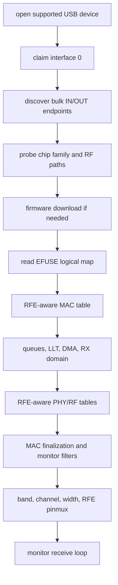

# Realtek Driver

`openipc-rtl88xx` is the shared Rust Realtek USB/HAL driver.

It is not a wrapper around devourer. The code was written from the reference
projects, then split into Rust modules for transport, firmware, MAC setup,
radio setup, RX parsing, TX descriptors, and TX power.

## Supported Device IDs

The source of truth is `SUPPORTED_DEVICES` in the driver crate. The current
table includes the Realtek reference IDs, common RTL8812AU OEM IDs used by
PixelPilot, the RTL8821AU vendor IDs mirrored from devourer, and Jaguar3
RTL8812CU/EU and RTL8822CU/EU IDs from devourer:

| VID:PID     | Family Hint | Label                               |
| ----------- | ----------- | ----------------------------------- |
| `0bda:8812` | RTL8812     | RTL8812AU / RTL8811AU / RTL8812EU   |
| `0bda:881a` | RTL8812     | RTL8812AU-VS / RTL8812EU variant    |
| `0bda:881b` | RTL8812     | RTL8812AU-VL / RTL8812EU variant    |
| `0bda:881c` | RTL8822E    | RTL8812EU variant                   |
| `0bda:0811` | RTL8812     | RTL8811AU                           |
| `0bda:a811` | RTL8812     | RTL8811AU                           |
| `0bda:b811` | RTL8812     | RTL8811AU / RTL8821AU variant       |
| `2357:0101` | RTL8812     | TP-Link Archer T4U                  |
| `2357:0103` | RTL8812     | TP-Link Archer T4UH                 |
| `2357:010d` | RTL8812     | TP-Link Archer T4U v2               |
| `2357:010e` | RTL8812     | TP-Link Archer T4UH v2              |
| `0b05:17d2` | RTL8812     | ASUS USB-AC56 / RTL8812AU           |
| `2604:0012` | RTL8812     | Tenda U12 / RTL8812AU               |
| `0409:0408` | RTL8812     | NEC AtermWL900U / RTL8812AU         |
| `0586:3426` | RTL8812     | ZyXEL NWD6605 / RTL8812AU           |
| `0bda:8813` | RTL8814     | RTL8814AU                           |
| `0bda:0820` | RTL8821     | RTL8821AU                           |
| `0bda:0821` | RTL8821     | RTL8821AU                           |
| `0bda:0823` | RTL8821     | RTL8821AU                           |
| `0bda:8822` | RTL8821     | RTL8821AU                           |
| `0411:0242` | RTL8821     | Buffalo RTL8821AU                   |
| `0411:029b` | RTL8821     | Buffalo RTL8821AU                   |
| `04bb:0953` | RTL8821     | I-O Data RTL8821AU                  |
| `056e:4007` | RTL8821     | Elecom RTL8821AU                    |
| `056e:400e` | RTL8821     | Elecom RTL8821AU                    |
| `056e:400f` | RTL8821     | Elecom RTL8821AU                    |
| `0846:9052` | RTL8821     | Netgear RTL8821AU                   |
| `0e66:0023` | RTL8821     | Hawking RTL8821AU                   |
| `2001:3314` | RTL8821     | D-Link RTL8821AU                    |
| `2001:3318` | RTL8821     | D-Link RTL8821AU                    |
| `2019:ab32` | RTL8821     | Planex RTL8821AU                    |
| `20f4:804b` | RTL8821     | TRENDnet RTL8821AU                  |
| `2357:011e` | RTL8821     | TP-Link RTL8821AU                   |
| `2357:0120` | RTL8821     | TP-Link Archer T2U Plus / RTL8821AU |
| `2357:0122` | RTL8821     | TP-Link RTL8821AU                   |
| `3823:6249` | RTL8821     | Obihai RTL8821AU                    |
| `7392:a811` | RTL8821     | Edimax RTL8821AU                    |
| `7392:a812` | RTL8821     | Edimax RTL8821AU                    |
| `7392:a813` | RTL8821     | Edimax RTL8821AU                    |
| `7392:b611` | RTL8821     | Edimax RTL8821AU                    |
| `0bda:c812` | RTL8822C    | RTL8812CU / RTL8822CU default PID   |
| `0bda:c82c` | RTL8822C    | RTL8822CU                           |
| `0bda:c82e` | RTL8822C    | RTL8812CU / RTL8822CU WiFi-only PID |
| `0bda:a81a` | RTL8822E    | RTL8812EU / LB-LINK BL-M8812EU2     |
| `0bda:e822` | RTL8822E    | RTL8822EU                           |
| `0bda:a82a` | RTL8822E    | RTL8822EU                           |

The chip probe still reads `SYS_CFG2` after opening the device. Chip IDs `0x13`
and `0x17` select RTL8822C and RTL8822E respectively. That register is
authoritative because RTL8812EU can enumerate with the same `0bda:8812`,
`0bda:881a`, or `0bda:881b` IDs used by Jaguar1 adapters; the table is only the
first discovery filter.

Platform-specific filters are derived from this table:

- the WASM package exports `supportedUsbFilters()` from `SUPPORTED_DEVICES` for
  `navigator.usb.requestDevice`,
- the desktop/Tauri backend reports devices through the same driver table and
  runtime `nusb` discovery,
- Nebulus uses the table for desktop/WebUSB discovery and Android permission
  filtering,
- the legacy Android Tauri plugin generates its USB attach XML and Kotlin
  runtime filter from `SUPPORTED_DEVICES` during its Rust build script.

## Implemented Operations

- descriptor-driven endpoint discovery,
- vendor-control register reads and writes through request `0x05`,
- firmware download for supported Jaguar-family chips,
- Jaguar3 RTL8812CU/EU and RTL8822CU/EU firmware download, MAC/USB setup,
  RFE-aware BB/AGC/RF tables, 24-byte RX descriptor parsing, 48-byte checksummed
  TX descriptors, 5/10 MHz narrowband setup, WiFi-only coex/H2C keepalives, and
  clean monitor shutdown,
- RTL8822E software-power-cut/burst EFUSE reads, PA-bias trim, DACK, IQK,
  TXGAPK, DPK bypass, RFE 21-24 antenna control, RFE pinmux, channel-specific TX
  shaping, per-path TXAGC, and thermal tracking,
- EFUSE logical-map parsing for MAC address, RFE type, amplifier flags, TX BB
  swing bytes, thermal baseline, and TX-power PG blocks,
- LLT/page setup and queue/FIFO setup,
- RFE-aware MAC/BB/RF table loading, including conditional RF table opcodes,
- monitor filters,
- channel, channel-width, band-switch, RFE pinmux, and BB-swing setup for
  RTL8812/RTL8821/RTL8814 plus Jaguar3 5/10/20 MHz tuning,
- the RTL8822C 3-wire/RXBB/AGC/CCK-RXIQ channel sequence required for working
  2.4 GHz receive,
- RX bulk reads, including multi-transfer in-flight reads mirroring newer
  devourer's always-posted bulk-IN model,
- C2H packet surfacing, RTL8814 TX-status parsing, and optional corrupted-FCS
  RX packet retention for diagnostics,
- TX bulk writes, TX-mode/radiotap parsing for legacy/HT/VHT injection,
  descriptors, and TX power overrides for adaptive-link feedback,
- devourer-compatible VID/PID targeting, bulk-OUT endpoint override, RTL8814
  firmware path/chunk controls, IQK policy switches, TX-power skip switch, and
  RTL8814 legacy-descriptor escape hatch,
- EFUSE-backed per-rate TXAGC programming, including the newer devourer 8812A
  PG table and regulatory limit table,
- RTL8812 thermal power tracking, RTL8812/RTL8814 IQK paths, Jaguar3 DACK/IQK
  plus thermal-power/LCK tracking, and a monitor-mode PHYDM false-alarm/DIG
  watchdog,
- thermal meter, false-alarm counters, RTL8814 queue-depth, BB-register, and
  BB-dbgport diagnostics.

## Initialization Shape



Cold start is the hard part. A warm adapter that already has firmware running
can appear to work even when parts of initialization are wrong. Treat cold-plug
testing as the real validation case.

## Native And WebUSB Sharing

The HAL is async and transport-oriented. Native builds use `nusb` for desktop
USB. Browser builds use the WebUSB-capable `nusb-webusb` package after the user
grants the device in JavaScript.

On native targets, the driver’s `*_async` methods are async-shaped wrappers
around blocking `nusb` operations. They exist so the HAL register, firmware, and
channel sequences can be shared with WebUSB. Native callers should run them from
a worker/blocking context, not a latency-sensitive async executor. On wasm, the
same calls resolve through real WebUSB promises.

The browser still needs the same Realtek HAL work as native: WebUSB changes how
control and bulk transfers are issued, not what registers or firmware steps the
adapter needs.

Android is another transport boundary. Nebulus calls `UsbManager` through its
small JNI module for discovery and permission, then wraps the already-open file
descriptor with `nusb::Device::from_fd`. The legacy Station performs the same
handoff through `tauri-plugin-openipc-usb`. In either application, the shared
Realtek initialization and RX/TX code takes over after permission is granted.

## Runtime Options

Native and browser code use the same two option structs:

- `DriverOptions`: USB reset behavior, VID/PID targeting, and bulk-OUT endpoint
  override.
- `MonitorOptions`: bad-FCS retention, TX-power programming skip, IQK/TXGAPK
  policy, RTL8814 firmware download mode/chunk size, and an optional Jaguar1
  RX-chain mask.

Native builds additionally read devourer-compatible environment variables:

| Variable                           | Effect                                                 |
| ---------------------------------- | ------------------------------------------------------ |
| `DEVOURER_VID` / `DEVOURER_PID`    | Target a specific USB adapter.                         |
| `DEVOURER_SKIP_RESET`              | Skip USB reset before claiming the adapter.            |
| `DEVOURER_TX_EP`                   | Force a bulk-OUT endpoint.                             |
| `DEVOURER_SKIP_TXPWR`              | Skip TX-power table programming during channel set.    |
| `DEVOURER_FORCE_IQK`               | Run IQK where it is otherwise opt-in, notably RTL8814. |
| `DEVOURER_DISABLE_IQK`             | Suppress IQK.                                          |
| `DEVOURER_SKIP_IQK`                | Suppress IQK using newer devourer naming.              |
| `DEVOURER_SKIP_TXGAPK`             | Skip RTL8822E TX gain calibration.                     |
| `DEVOURER_8814_FWDL=kernel\|rtw88` | Select the RTL8814 firmware path.                      |
| `DEVOURER_8814_FWDL_CHUNK=<n>`     | Override RTL8814 kernel-path chunk size.               |
| `DEVOURER_RX_PATHS=<mask>`         | Select Jaguar1 RX chains after channel setup and IQK.  |
| `DEVOURER_TX_LEGACY_8812_DESC`     | Use the older 8812 TX descriptor shape on RTL8814.     |

The browser API exposes the same choices with
`WebUsbRealtekDevice.fromWebUsbDeviceWithOptions`,
`initializeMonitorAdvancedWithTxgapk`, and `sendPacketWithOptions`.

## Diagnostics Strategy

The Rust driver exposes diagnostics as explicit calls, not background threads.
That is deliberate.

Devourer has native background work because it owns the whole process and can
coordinate that with libusb transfer timing. `openipc-rs` is a library used from
native CLI, Tauri, and browser/WebUSB code. A hidden polling thread in the
driver would be hard to schedule correctly across all three.

Applications should schedule diagnostics at the app boundary:

- native CLI/Tauri can poll from the existing RX loop or an app-owned worker,
- browser apps can use timers, animation frames, or a Web Worker if UI jank
  appears,
- the core driver APIs remain deterministic and testable.

Available explicit hooks include thermal status, false-alarm counters, RTL8814
queue-depth registers, BB register/dbgport reads, PHYDM DIG watchdog ticks,
IQK, RTL8812 power tracking ticks, Jaguar3 coex keepalive, C2H payloads, and
RTL8814 TX-status parsing.

## Validation Boundary

The driver does not build against devourer. Hardware bring-up still needs
register-trace comparison and live adapter tests before each supported chip can
be marked final.

Current status:

- RTL8812/RTL8821 cold initialization, EFUSE-backed RFE selection,
  devourer-style band switching, EFUSE TX power, optional by-rate TX power, and
  regulatory limit handling are implemented and need live validation.
- RTL8814 reserved-page/DDMA firmware download, RFE GPIO pin-select,
  band-specific RFE pinmux, BB swing, and post-firmware MAC writes are
  implemented and need live validation. The default path follows the newer
  devourer kernel-faithful flow; `DEVOURER_8814_FWDL=rtw88` keeps the older
  rtw88-mimic fallback available for A/B testing.
- RTL8812 thermal power tracking, RTL8812 IQK, RTL8814 IQK, and the PHYDM
  false-alarm/DIG watchdog have Rust implementations. They are exposed natively
  and through WASM, but still need register-trace comparison on real adapters.
- RTL8812CU/EU and RTL8822CU/EU Jaguar3 support is audited through devourer
  `7cd094a`. The RTL8822E firmware and all seven generated table arrays are
  byte-for-byte equal to the reference commit. Chip-ID dispatch, V1 EFUSE,
  PA-bias, RFE defaults/pinmux, DACK, IQK, TXGAPK, DPK bypass, per-rate TXAGC,
  thermal tracking, descriptors, coex/H2C, and shutdown are implemented. This
  is still not a substitute for hardware proof: each adapter should only be
  called on-air validated after cold-plug traces and sustained TX/RX runs match
  devourer on that hardware.
- Newer devourer runtime TX-mode behavior is mirrored: radiotap RATE/MCS/VHT
  wins, a programmatic default can fill rate-less packets, 5 GHz CCK TX is
  clamped to OFDM, and the newer 8812/8821/8814 descriptor differences are
  reflected in `openipc-core`.
- Newer devourer diagnostics are available in native Rust and through the WASM
  wrapper: thermal bucket, false-alarm counters, 8814 queue-depth registers,
  BB register reads, BB dbgport snapshots, Jaguar3 thermal tracking ticks, C2H
  payloads, and RTL8814 TX-status reports.
- Software-only hardening tests now cover malformed RX aggregates, zero-length
  descriptors, aggregate tail handling, C2H driver-info/shift offsets, PHY
  status byte boundaries, CRC/ICV flag surfacing, firmware-header stripping,
  chip-family TX descriptor selection, descriptor checksums, oversized TX
  payload rejection, VHT descriptor fields, and center-channel mapping for
  common 40/80 MHz channels.
- Native register control transfers now go through a small fakeable transport
  boundary with retry tests. Control transfers and normal bulk RX/TX retry
  transient cancellation/timeouts and endpoint stalls, clearing the endpoint
  halt before retrying stalled bulk endpoints. Disconnects, invalid requests,
  unknown OS errors, and hardware faults still fail fast. Firmware bulk writes
  keep a conservative no-replay policy on timeout.
- The remaining work is hardware proof: cold-plug runs, register-trace
  comparison, and a fixture matrix across adapter models and operating systems.

By-rate TX power is default-off, matching devourer's USB-build behavior. Native
users can enable it with `OPENIPC_RS_ENABLE_TXPWR_BY_RATE=1` or the devourer
compatibility name `DEVOURER_ENABLE_TXPWR_BY_RATE=1`. The active regulatory
table defaults to FCC and can be changed with `OPENIPC_RS_REGULATION=ETSI`,
`MKK`, or `WW` on native builds. Browser builds keep the default FCC path unless
an application adds its own configuration surface.

When debugging a new adapter, start with:

```sh
cargo run -p openipc-cli -- list-supported
cargo run -p openipc-cli -- probe
cargo run -p openipc-cli -- recv --key gs.key --rf-channel 161 --max-transfers 100
```

For the detailed source-to-source audit checklist, see
[Devourer Parity Audit](devourer-parity.md).
