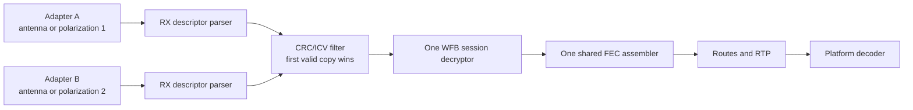

# Receive Diversity

Nebulus can combine two or more supported Realtek USB adapters tuned to the
same RF channel. This is packet-selection diversity: every radio demodulates
802.11 independently, then Rust keeps the first valid copy of each WFB packet.
It is not coherent IQ combining, so adapters do not need synchronized clocks.

## Why One Pipeline

The radios receive copies of the same encrypted WFB fragments. Running one
complete pipeline per radio would decrypt, FEC-assemble, RTP-depacketize, and
decode the same media more than once. Nebulus instead merges valid radio
packets before decryption. Unique fragments from either receiver enter one FEC
block, which means the combined stream can recover a block even when neither
adapter received enough fragments alone.

The selector keys data packets by WFB channel, session generation, and data
nonce. Session packets use their crypto-box nonce. A bounded cache rejects late
copies. The first valid packet is forwarded immediately; Nebulus does not wait
to compare signal strength, so diversity adds no deliberate latency window.

## Configure Nebulus

1. Attach the adapters and open **Settings → Receiver**.
2. Choose the primary receiver. Adaptive-link and VPN uplink use this radio.
3. Enable one or more entries under **Diversity receivers**.
4. Run preflight, then start RX.

All selected radios use the same channel, width, offset, Link ID, and key. A
profile stores the primary and diversity selections together.

In a browser, press **Add adapter** once for each radio. Each call opens the
WebUSB permission picker because browsers grant devices individually. Already
authorized devices can be started together without another prompt. Android
likewise requests USB permission for each selected device through `UsbManager`.

## USB Identity And Topology

Desktop identities include VID/PID plus the host bus and hub-port chain, so two
identical adapters remain independently selectable. Android uses the system USB
device name. WebUSB prefers the USB serial number and otherwise assigns an
authorized-device index for the current browser session.

Two high-power WiFi adapters can exceed a phone or passive hub's power budget.
Use a powered hub on Android, and prefer separate root-hub paths on desktop
when high-rate transfers show stalls. Antennas should have useful spatial or
polarization separation; placing identical antennas together produces less
diversity gain.

## Scheduling And Uplink

Native and Android builds keep one bounded bulk-IN capture worker per adapter.
Owned USB buffers move to one processor and return to their originating
endpoint before decoding, audio, recording, or diagnostics. Each Jaguar3 radio
also retains its own maintenance task. The browser races one local async
completion future per WebUSB endpoint on its single-threaded executor.

Only the primary radio transmits adaptive-link feedback or VPN traffic. This
avoids sending simultaneous identical uplink frames from colocated adapters.
If a secondary disconnects, reception continues in a degraded state while at
least one radio remains. If every radio is lost, the normal native automatic
recovery policy restarts the receiver. Restart RX after reconnecting a
secondary to add it back to the active set.

## Diagnostics

**Diagnostics → Pipeline health → Receive adapters** shows:

- online/offline state;
- USB transfers, bytes, errors, and bounded-queue drops;
- per-radio RSSI and SNR;
- first-copy wins contributed by each radio;
- duplicate copies discarded before decryption;
- total unique packets and deduplication-cache occupancy.

A high duplicate ratio is normal when both antennas have strong reception. A
radio with few wins may still be valuable because its unique packets appear
when the primary antenna is shadowed. Queue drops should remain zero; nonzero
values indicate that the shared protocol/decode worker cannot keep up.

## Library Integration

Applications can use `openipc_core::DiversityCombiner` independently of
Nebulus. Parse each adapter's descriptor with its own
`RealtekDevice::rx_descriptor_kind()`, reject CRC/ICV failures, call
`observe_frame(source, frame, layout)`, and send accepted packets to one
`ReceiverRuntime`. `DiversityStats` provides source contribution counters for
custom diagnostics.

The core test suite includes a synthetic FEC case where fragments are split
between two sources and the shared assembler recovers the complete block. It
also verifies duplicate suppression and data-nonce reuse after a WFB session
change.
