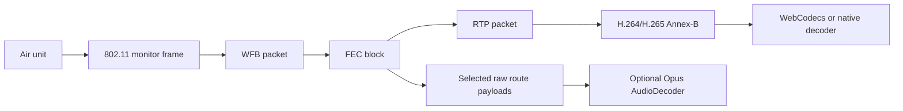
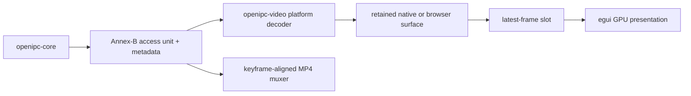

# Video Pipeline

OpenIPC video arrives over WiFi as WFB data carrying RTP. `openipc-rs` turns
those packets into encoded video frames. It does not decode pixels in the core
pipeline.



## Receive Path

1. USB bulk-IN returns a Realtek RX aggregate.
2. The Realtek parser splits the aggregate into 802.11 packets and extracts
   descriptor metadata such as RSSI, SNR, sequence number, and flags.
3. The OpenIPC filter checks mirrored `57:42:<channel_id>` MAC fields and radio
   ports.
4. WFB session packets update the data-decryption session key. The fixed
   session fields are required; optional WFB-ng TLV fields are accepted and
   ignored unless a higher layer decides to inspect them later.
5. WFB data packets decrypt into primary and parity FEC fragments.
6. Reed-Solomon recovery repairs missing primary fragments where possible. If
   a whole WFB block is lost, the assembler skips it once later blocks prove
   the stream has moved on, matching wfb-ng/PixelPilot receive behavior.
7. `ReceiverRuntime` routes recovered payload bytes to the configured app
   outputs.
8. The configured video route treats recovered payload bytes as RTP and feeds
   them to `RtpDepacketizer`.
9. RTP H.264/H.265 depacketization emits Annex-B frames.

`PayloadPipeline` is deliberately generic. It emits recovered bytes plus
channel and sequence metadata. It does not know whether those bytes are RTP,
MAVLink, MSP, CRSF, IP, or something custom.
`ReceiverRuntime` is the normal app-facing helper. Internally it uses
`PayloadRouteManager` to keep one pipeline per WFB channel/key slot and fan
recovered payloads out to one or more route IDs.

For the video channel, OpenIPC convention says the recovered payload bytes are
RTP packets. Apps can mirror those RTP bytes, feed them into the built-in RTP
depacketizer, or use their own video handling:

The short example below assumes Jaguar1 RX descriptors. For a live adapter,
prefer `push_rx_transfer_with_kind(..., device.rx_descriptor_kind(), ...)` so
Jaguar3 CU/EU transfers use the correct descriptor offsets.

```rust
let batch = receiver.push_rx_transfer(
    transfer,
    &ReceiverBatchOptions {
        raw_payload_routes: vec![VIDEO_ROUTE],
        ..ReceiverBatchOptions::default()
    },
)?;

for rtp in batch.raw_payloads {
    mirror_rtp(&rtp.data)?;
}
for frame in batch.frames {
    decoder.push(frame.data)?;
}
```

Applications may delegate RTP processing to another execution context without
running the depacketizer twice. Set `depacketize_video: false` and include the
video route in `raw_payload_routes`; the batch then contains raw recovered RTP
but no Annex-B frames. Nebulus uses this mode in browsers to transfer RTP to its
Rust Web Worker, while native builds keep the default in-process behavior.

One recovered RTP packet may or may not complete a video access unit. The
depacketizer may return `None` for several packets and then return one Annex-B
frame when the RTP marker identifies the end of a picture. Some OpenIPC
senders omit markers on ordinary pictures, so an RTP timestamp transition is
the fallback boundary: packets with one timestamp belong to one access unit.

Boundary detection and damage policy are separate. The reusable core defaults
to strict dropping with `DamagedFramePolicy::Drop`. Nebulus selects
`DamagedFramePolicy::Forward` for FPV: sequence gaps retain the bytes that did
arrive, an FU gap retains only its contiguous prefix, incomplete FU chains
flush when the timestamp advances, and the resulting `DepacketizedFrame`
records `MissingSlice` or `TruncatedFragment`. Native decoders and WebCodecs
then get a chance to conceal the missing region. A damaged keyframe is never
used to initialize or resynchronize a decoder. If submission fails, Nebulus
resets that decoder and waits for the next clean keyframe.

In a long-running receiver, handle per-frame WFB errors as drops and keep
processing the rest of the USB aggregate. A malformed Realtek aggregate is a
batch-level error; a single missing session, failed decrypt, or bad WFB packet
should not stop the receive loop.

Non-video WFB channels use the same payload recovery machinery and stop at
recovered bytes. Add another route for MAVLink, MSP, CRSF, data ports, or custom
radio ports. Audio can either be a separate wfb-ng audio route or a filtered RTP
tap on the main video route. Nebulus can inspect bytes, log a throttled summary,
forward unchanged payloads over UDP on native targets, or decode Opus audio.
Auto mode recognizes the documented OpenIPC Opus payload type 98 stream. It does
not infer arbitrary audio payload types. Telemetry-to-OSD routes decode MAVLink,
MSP, or CRSF in Nebulus after `openipc-core` returns the recovered raw payload.

The OpenIPC tunnel/data channel is handled by the internal VTX network and the
optional **Setup → Network → VPN / tunnel** bridge rather than the custom route
builder. That keeps the fixed tunnel RX/TX pair (`0x20`/`0xa0`) out of
user-defined payload routing while still using the same core route machinery.

## Waybeam Compatibility

[OpenIPC Waybeam](https://github.com/OpenIPC/waybeam_venc) emits H.265-only RTP
in its normal `outgoing.streamMode: "rtp"` configuration. Its video contract is
directly covered by `openipc-core` compatibility vectors reviewed against
Waybeam commit `82f72ac`:

- RTP version 2, dynamic payload type 97, a 90 kHz timestamp clock, and random
  initial sequence/timestamp/SSRC values;
- separate single-NAL VPS, SPS, PPS, and small slice packets;
- RFC 7798 type-49 fragmentation for slices larger than `maxPayloadSize`;
- marker only on the final packet of an encoded picture;
- repeated VPS/SPS/PPS before IDR types 19 and 20; and
- type-0 `TRAIL_N` pictures generated by Waybeam's refPred resilience modes.

Waybeam intentionally does not aggregate video into type-48 packets, although
the Rust depacketizer accepts those too. Payload sizes from Waybeam's supported
576–4000-byte range are below the receiver's access-unit guard. The resulting
Annex-B access units feed all `openipc-video` H.265 backends without a
Waybeam-specific decode path.

Set Waybeam to `streamMode: "rtp"`; its `compact` mode is raw chunked NAL data,
not RTP, and is not accepted by the video route. Waybeam Opus uses payload type
98, which Nebulus supports. For one mixed video WFB route, set
`outgoing.audioPort` to `0`. Keeping Waybeam's default dedicated audio port
`5601` requires a separate VTX WFB sender and matching Nebulus audio route. The
optional timing sidecar on port 5602 is metadata, not part of the video RTP
stream.

## Divinus Compatibility

[OpenIPC Divinus](https://github.com/OpenIPC/divinus) has two RTP paths. Its
RTSP server emits ordinary H.264/H.265 single-NAL packets and RFC 7798 H.265
fragments. Its special `stream.dest: udp://...` output, commonly pointed at a
WFB sender, has older wire behaviors covered by `openipc-core` tests
reviewed against Divinus commit `fa379ca`:

- H.264 and H.265 both use dynamic payload type 96;
- the marker is set for keyframes rather than every completed picture, while
  the timestamp advances at each NAL boundary; and
- fragmented H.265 uses a two-byte legacy FU prefix that omits the HEVC
  layer/temporal-id byte and stores the original first NAL-header byte in the
  FU type field; and
- HAL encoder packs containing several Annex-B NAL units are split in place
  before parameter-set tracking and access-unit assembly.

Automatic codec detection locks H.265 when it sees an unambiguous VPS, SPS, or
PPS despite payload type 96. Nebulus's explicit **H.264** or **H.265** codec
preference is also passed into the depacketizer, which is useful when joining a
Divinus stream after its parameter sets. Complete unmarked pictures are emitted
when the RTP timestamp advances. In Nebulus best-effort mode, incomplete FU
chains are forwarded as damaged at that same transition. Both Divinus paths
therefore produce the same Annex-B access-unit boundary used by the native and
browser decoders.

## Annex-B Frames

Annex-B is the byte-stream form of H.264/H.265 where NAL units are separated by
start codes such as `00 00 00 01`. This is a convenient boundary for WebCodecs,
file output, and native player integration because the protocol stack can
deliver complete encoded access units without decoding pixels itself.

In this project, an Annex-B frame means "one encoded access unit ready for a
decoder." It may contain multiple NAL units, such as parameter sets plus an IDR
slice. Rust marks keyframes so the UI can wait for a valid decoder entry point
after packet loss or decoder reset.

## Decode And Render

Nebulus passes complete access units to `openipc-video`. The selected backend is
VideoToolbox on macOS, VA-API on Linux, Media Foundation/D3D11 on Windows,
MediaCodec on Android, or WebCodecs in the browser. H.265 profile support still
depends on the operating system, browser, and decoder hardware.

`ReceiverRuntime` appends completed access units directly into its batch. It
does not allocate an empty temporary frame vector for each RTP packet, and
Nebulus moves each completed frame into `openipc-video` rather than cloning its
encoded bytes. Decoder input is bounded; once a backend cannot keep up it
clears stale dependency state and waits for the next random-access frame.

The primary render path is:



In the Nebulus browser build, Trunk compiles Nebulus's internal
`nebulus-decode-worker` binary target once and the app instantiates it as
separate RTP and decoder workers. RTP packets are grouped
into one transferable buffer per receive batch. The RTP worker emits complete
access units through a direct `MessageChannel`; bounded, keyframe-aware queues
prevent decoder pressure from reaching WebUSB. A one-frame acknowledgement gate
prevents decoded surfaces from accumulating in the main browser event queue.

## Recording

Nebulus records encoded H.264/H.265 access units before decode. It waits for a
random-access frame, reads codec configuration and dimensions from its parameter
sets, and uses RTP timestamps to mux MP4 without re-encoding. Each
access unit remains one MP4 sample, including streams with multi-slice pictures.
The first enabled Opus audio route is stripped of RTP framing and muxed as a
second track using its own RTP clock. See
[Nebulus Recording](./nebulus.md#recording) for timing and size limits.
