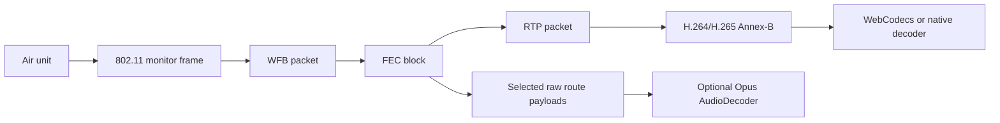
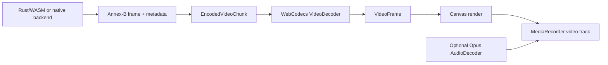

# Video Pipeline

OpenIPC video arrives over WiFi as WFB data carrying RTP. `openipc-rs` turns
those packets into encoded video frames. It does not decode pixels in the core
pipeline.



## Receive Path

1. USB bulk-IN returns a Realtek RX aggregate.
2. The Realtek parser splits the aggregate into 802.11 packets and extracts
   descriptor metadata such as RSSI, SNR, sequence number, and flags.
3. The OpenIPC filter checks mirrored `57:42:<channel_id>` MAC fields and radio
   ports.
4. WFB session packets update the data-decryption session key. The fixed
   session fields are required; optional WFB-ng TLV fields are accepted and
   ignored unless a higher layer decides to inspect them later.
5. WFB data packets decrypt into primary and parity FEC fragments.
6. Reed-Solomon recovery repairs missing primary fragments where possible. If
   a whole WFB block is lost, the assembler skips it once later blocks prove
   the stream has moved on, matching wfb-ng/PixelPilot receive behavior.
7. `ReceiverRuntime` routes recovered payload bytes to the configured app
   outputs.
8. The configured video route treats recovered payload bytes as RTP and feeds
   them to `RtpDepacketizer`.
9. RTP H.264/H.265 depacketization emits Annex-B frames.

`PayloadPipeline` is deliberately generic. It emits recovered bytes plus
channel and sequence metadata. It does not know whether those bytes are RTP,
MAVLink, MSP, CRSF, IP, or something custom.
`ReceiverRuntime` is the normal app-facing helper. Internally it uses
`PayloadRouteManager` to keep one pipeline per WFB channel/key slot and fan
recovered payloads out to one or more route IDs.

For the video channel, OpenIPC convention says the recovered payload bytes are
RTP packets. Apps can mirror those RTP bytes, feed them into the built-in RTP
depacketizer, or use their own video handling:

The short example below assumes Jaguar1 RX descriptors. For a live adapter,
prefer `push_rx_transfer_with_kind(..., device.rx_descriptor_kind(), ...)` so
Jaguar3 CU/EU transfers use the correct descriptor offsets.

```rust
let batch = receiver.push_rx_transfer(
    transfer,
    &ReceiverBatchOptions {
        raw_payload_routes: vec![VIDEO_ROUTE],
        ..ReceiverBatchOptions::default()
    },
)?;

for rtp in batch.raw_payloads {
    mirror_rtp(&rtp.data)?;
}
for frame in batch.frames {
    decoder.push(frame.data)?;
}
```

One recovered RTP packet may or may not complete a video access unit. The
depacketizer may return `None` for several packets and then return one Annex-B
frame when a marker/fragment boundary completes. Fragmented H.264/H.265 NAL
units are dropped if their RTP sequence numbers have a gap, because feeding
corrupted Annex-B into WebCodecs is worse than waiting for the next clean
access unit.

In a long-running receiver, handle per-frame WFB errors as drops and keep
processing the rest of the USB aggregate. A malformed Realtek aggregate is a
batch-level error; a single missing session, failed decrypt, or bad WFB packet
should not stop the receive loop.

Non-video WFB channels use the same payload recovery machinery and stop at
recovered bytes. Add another route for MAVLink, MSP, CRSF, data ports, or custom
radio ports. Audio can either be a separate wfb-ng audio route or a filtered RTP
tap on the main video route. The station route manager can inspect bytes, log a
throttled summary, forward them over UDP in native/Tauri mode, or decode audio
RTP in the browser frontend. The currently implemented audio decoder is Opus;
Auto mode recognizes the documented OpenIPC Opus payload type 98 stream. It does
not parse MAVLink messages.

The OpenIPC tunnel/data channel is handled by Station's separate VPN tab rather
than the custom route builder. That keeps the fixed tunnel RX/TX pair
(`0x20`/`0xa0`) out of user-defined payload routing while still using the same
core route machinery internally.

## Annex-B Frames

Annex-B is the byte-stream form of H.264/H.265 where NAL units are separated by
start codes such as `00 00 00 01`. This is a convenient boundary for WebCodecs,
file output, and native player integration because the protocol stack can
deliver complete encoded access units without decoding pixels itself.

In this project, an Annex-B frame means "one encoded access unit ready for a
decoder." It may contain multiple NAL units, such as parameter sets plus an IDR
slice. Rust marks keyframes so the UI can wait for a valid decoder entry point
after packet loss or decoder reset.

## Decode And Render

The station app decodes with WebCodecs where the browser or WebView supports
the codec string returned by Rust. H.264 is broadly available; H.265 depends on
browser and operating-system support.

The render path is:



## Recording

The station records rendered video from the canvas. When an audio route or
filtered mixed-audio tap is enabled and the browser/WebView can decode it, the
audio mix is attached to the same `MediaRecorder` stream. That means recording
captures what the frontend actually played, not the raw RF stream. For protocol
debugging, use the native CLI to write Annex-B output or save USB captures.
