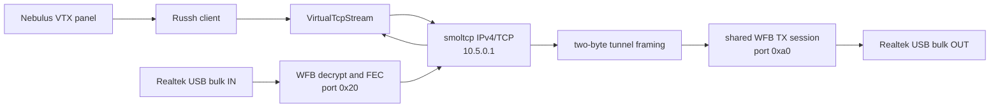

# VTX Control

Nebulus configures an existing OpenIPC air unit without changing its firmware.
The implementation follows the WFB mode used by PixelPilot_rk:

| Item                   | Value             |
| ---------------------- | ----------------- |
| Ground station address | `10.5.0.1/24`     |
| VTX address            | `10.5.0.10`       |
| WFB tunnel downlink    | radio port `0x20` |
| WFB tunnel uplink      | radio port `0xa0` |
| SSH                    | TCP `22`          |
| Video-mode service     | TCP `12355`       |
| Stock login            | `root` / `12345`  |

APFPV and `aalink` are deliberately outside this path. It needs no VTX
firmware patch, proxy, WebSocket bridge, or internet connection.

## Data Flow



`openipc-core` recovers the raw tunnel payload. `openipc-uplink` walks every
two-byte big-endian length entry in the payload because `wfb_tun` may aggregate
several IP packets, then passes those packets into smoltcp and exposes a Tokio
`AsyncRead + AsyncWrite` stream. Browser and desktop builds use Russh 0.50
because its RustCrypto backend builds for `wasm32-unknown-unknown`. Android
uses current Russh with Ring, avoiding a Linux-only errno call in Russh 0.50's
memory-lock helper. Both are hidden behind the same `SshClient` API.

On native targets the SSH command executor runs separately from USB capture.
On the web it runs as a local future. The receiver loop owns IP polling and WFB
transmission on both, so a slow SSH command cannot block video capture. TCP
retransmission recovers from a temporarily full radio TX queue.

## Nebulus

1. Enable **Setup → VTX → Enable VTX control** before starting RX.
2. Start RX and wait for the radio link.
3. Open **Setup → VTX**, then select **Connect** or **Refresh config**.
4. Apply WFB, camera, telemetry, or adaptive-link settings.

**Refresh config** parses the known fields in the air unit's `wfb.yaml` and
`majestic.yaml` into the controls. Unknown keys remain visible in the raw
configuration snapshot and do not make refresh fail, which keeps the UI usable
with custom and newer firmware files.

The controls map to the current firmware behavior:

| Group                   | Firmware operation                                                                       |
| ----------------------- | ---------------------------------------------------------------------------------------- |
| WFB radio and broadcast | `wifibroadcast cli -s`, then one WFB restart per submitted batch                         |
| Camera and encoder      | Majestic `cli -s`, then one `killall -1 majestic` per submitted batch                    |
| Simple video mode       | text command to TCP `12355`                                                              |
| Telemetry               | serial console handling, `wifibroadcast cli -s`, GS render-route patch, then WFB restart |
| Adaptive link           | `/etc/alink.conf`, `/etc/txprofiles.conf`, and `alink_drone` lifecycle                   |
| Config refresh          | `/etc/majestic.yaml`, `/etc/wfb.yaml`, and optional adaptive-link files                  |
| System                  | VTX reboot                                                                               |

Nebulus asks for confirmation before RF and broadcast changes, video-mode or
encoder changes, ISP/sensor changes, telemetry restarts, adaptive-link changes,
TX-profile replacement, and reboot. Image controls and VTX recording settings
remain immediate because they do not normally disconnect the radio link.

Changing WFB channel or width can immediately break the current link. Set the
ground-station receiver profile to the same values before reconnecting.

The host-key field is optional for parity with PixelPilot's
`StrictHostKeyChecking=no`. For a pinned installation, enter the complete
`SHA256:...` fingerprint. A mismatch rejects the connection. Credentials are
stored with local Nebulus settings and excluded from support bundles.

## Library Use

The network is transport-neutral. Feed recovered tunnel payloads from any WFB
receiver and transmit its output with any WFB-capable radio:

```rust
use openipc_uplink::{
    NetworkConfig, SshClient, SshCredentials, UserspaceNetwork, VtxController,
    WfbSetting,
};

let mut network = UserspaceNetwork::new(NetworkConfig::default())?;
let stream = network.connect_tcp(22)?;

// While this future runs, keep polling `network`, feed recovered port 0x20
// payloads with `ingest_tunnel_payload`, and transmit every `drain_outbound`
// item through WFB port 0xa0.
let ssh = SshClient::connect(stream, SshCredentials::default()).await?;
let controller = VtxController::new(ssh);
controller
    .set_wfb_batch(&[
        WfbSetting::McsIndex(1),
        WfbSetting::FecK(8),
        WfbSetting::FecN(12),
    ])
    .await?;
# Ok::<(), Box<dyn std::error::Error>>(())
```

`UserspaceNetwork` has no hidden thread and opens no platform socket.
Applications choose their executor and polling cadence. Tests connect two
smoltcp peers through OpenIPC tunnel framing and verify a TCP handshake plus
bidirectional byte transfer without hardware.

## Optional OS VPN

The TUN interface remains an additional native feature. Enabling it mirrors
tunnel IP packets to the operating system, but internal VTX control does not
depend on it. The same settings therefore work in a browser, where arbitrary
TCP sockets and TUN devices are unavailable.
