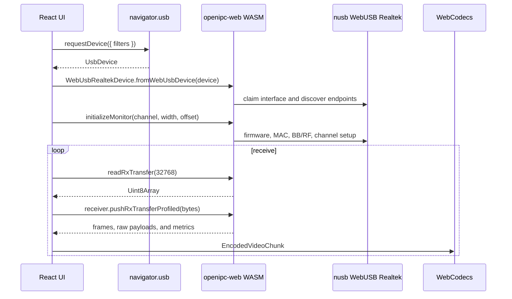

# WASM SDK Usage

`openipc-web` is the browser SDK layer. It exposes the Rust payload/RTP receive
path and the WebUSB Realtek device wrapper to JavaScript.

## Install Or Build

When published:

```sh
bun add @openipc-rs/web
```

From this repository:

```sh
bun run --cwd crates/openipc-web build
```

The generated package is written to `crates/openipc-web/pkg`.

## Browser Receive Flow



## Minimal Receiver

```ts
import init, {
  OpenIpcReceiver,
  WebUsbPhydmWatchdog,
  WebUsbPowerTracking8812,
  WebUsbJaguar3PowerTracking,
  WebUsbRealtekDevice,
  supportedUsbFilters,
} from "@openipc-rs/web";

await init();

const filters = JSON.parse(supportedUsbFilters());
const usbDevice = await navigator.usb.requestDevice({ filters });
const radio = await WebUsbRealtekDevice.fromWebUsbDevice(usbDevice);

const channelId = 7669206 << 8;
const keypairBytes = new Uint8Array(
  await (await fetch("/gs.key")).arrayBuffer(),
);
const telemetryChannelId = (channelId & 0xffffff00) | 0x10;
const receiver = OpenIpcReceiver.withKeypairOnly(channelId, keypairBytes, 0n);
receiver.setRxDescriptorKind(radio.rxDescriptorKind());
receiver.addKeyedRoute(2, telemetryChannelId, keypairBytes, 0n);
const jaguar3Power =
  radio.rxDescriptorKind() === "jaguar3"
    ? new WebUsbJaguar3PowerTracking()
    : undefined;

const initReport = await radio.initializeMonitor(36, 20, 0);
console.log(initReport.chip, initReport.status);
let nextJaguar3Maintenance = 0;

try {
  while (true) {
    const now = performance.now();
    if (
      radio.rxDescriptorKind() === "jaguar3" &&
      now >= nextJaguar3Maintenance
    ) {
      await radio.runJaguar3CoexKeepalive();
      await jaguar3Power?.tick(radio);
      nextJaguar3Maintenance = now + 2_000;
    }
    const transfer = await radio.readRxTransfer(32768);
    const batch = receiver.pushRxTransferProfiledWithRouteIds(
      transfer,
      false,
      new Uint32Array([2]),
    );

    for (const frame of batch.frames) {
      // frame.data is encoded Annex-B H.264/H.265.
      console.log(frame.codec, frame.data.byteLength, frame.isKeyFrame);
    }

    for (const payload of batch.rawPayloads) {
      // payload.data is raw recovered bytes from the requested route.
      // The SDK does not parse MAVLink, MSP, or other telemetry messages.
      console.log(payload.routeId, payload.packetSeq, payload.data.byteLength);
    }
  }
} finally {
  if (radio.rxDescriptorKind() === "jaguar3") {
    await radio.shutdownMonitor().catch(() => undefined);
  }
}
```

`pushRxTransferProfiled` is usually the best entry point for applications. It
returns frames and counters from the same call, so the UI can update metrics
without replaying the transfer through another parser.

Use `OpenIpcReceiver.withKeypairOnly(...)` plus `addKeyedRoute(...)` when you
want an explicit route list. `pushRxTransferProfiledWithRouteIds(...)` controls
which route payloads are copied back to JavaScript for the current transfer.

`OpenIpcReceiver.withKeypair(...)` remains as a shortcut for video plus the
default telemetry downlink route (`link_id:0x10`). It returns those bytes
through the neutral `rawPayloads` field and the older `mavlinkPayloads` alias.
The Rust core uses `ReceiverRuntime` with an internal `PayloadRouteManager` to
keep one WFB runtime per channel/key slot and fan recovered payloads out by
route ID.

## Audio Route

Station can play audio when the air unit sends a supported RTP audio codec. The
currently implemented decoder path is Opus. The common OpenIPC setup mixes Opus
RTP payload type 98 into the main video RTP route, so the WASM SDK exposes
filtered RTP taps: Rust copies only the selected payload type back to JavaScript
while the video depacketizer keeps consuming the same route.

Opus RTP is simple: once the RTP header is removed, the remaining bytes are the
Opus payload. Convert RTP timestamps with the fixed Opus RTP clock rate of
48 kHz.

```ts
const AUDIO_ROUTE = 3;
const OPUS_PT = 98;

const receiver = OpenIpcReceiver.withKeypairOnly(channelId, keypairBytes, 0n);
receiver.addKeyedRoute(AUDIO_ROUTE, channelId, keypairBytes, 0n);

const batch = receiver.pushRxTransferProfiledWithRouteIdsAndRtpTaps(
  transfer,
  false,
  new Uint32Array([]),
  new Uint32Array([AUDIO_ROUTE]),
  new Uint8Array([OPUS_PT]),
);

for (const payload of batch.rawPayloads) {
  const rtp = parseRtp(payload.data);
  if (!rtp) continue;
  audioDecoder.decode(
    new EncodedAudioChunk({
      type: "key",
      timestamp: rtpTimestampToUs(rtp.timestamp),
      data: rtp.payload,
    }),
  );
}
```

`parseRtp` and `rtpTimestampToUs` are small app-side helpers. The station app
keeps them outside the WASM SDK so apps can choose their own codec, payload
type, clocking, queueing, and audio output strategy.
For a separate wfb-ng audio profile, register `AUDIO_ROUTE` against that audio
channel id instead of `channelId`.

## Driver Diagnostics

The WebUSB driver exposes diagnostics as typed wasm-bindgen objects:

```ts
const thermal = await radio.readThermalStatus();
console.log(thermal.raw, thermal.bucket);

const fa = await radio.readFalseAlarmCounters();
console.log(fa.all, fa.ccaAll);

const queues = await radio.readQueueDepth8814();
console.log([...queues.values()]);

const dbg = await radio.readBbDbgport(0x0);
console.log(dbg.selector, dbg.value, dbg.chipAlive);
```

PHYDM and power tracking are explicit tick objects, not hidden background
workers:

```ts
const dig = new WebUsbPhydmWatchdog();
const digReport = await dig.tick(radio);
console.log(digReport.previousIgi, digReport.currentIgi);

const pwr = new WebUsbPowerTracking8812();
await pwr.init(radio);
const powerReport = await pwr.tick(radio, 36, 20);
console.log(powerReport.applied, powerReport.thermalAverage);

const jaguar3Power = new WebUsbJaguar3PowerTracking();
const jaguar3Report = await jaguar3Power.tick(radio);
console.log(jaguar3Report.thermalA, jaguar3Report.compensationA);
```

`supportedUsbFilters()` still returns a JSON string because the immediate
consumer is `navigator.usb.requestDevice({ filters })`.

## WebCodecs Rendering

```ts
import type { OpenIpcVideoFrame } from "@openipc-rs/web";

const canvas = document.querySelector<HTMLCanvasElement>("#video")!;
const canvasContext = canvas.getContext("2d", { alpha: false })!;

let decoder: VideoDecoder | undefined;
let decoderKey = "";
let waitingForKeyframe = true;

async function configureDecoder(frame: OpenIpcVideoFrame) {
  const key = `${frame.codec}:${frame.codecString}`;
  if (decoder && decoderKey === key) {
    return true;
  }

  const config: VideoDecoderConfig =
    frame.codec === "h264"
      ? {
          codec: frame.codecString,
          avc: { format: "annexb" },
          hardwareAcceleration: "prefer-hardware",
          optimizeForLatency: true,
        }
      : {
          codec: frame.codecString,
          hevc: { format: "annexb" },
          hardwareAcceleration: "prefer-hardware",
          optimizeForLatency: true,
        };

  const support = await VideoDecoder.isConfigSupported(config);
  if (!support.supported) {
    return false;
  }

  decoder?.close();
  decoder = new VideoDecoder({
    output: (videoFrame) => {
      const width = videoFrame.displayWidth || videoFrame.codedWidth;
      const height = videoFrame.displayHeight || videoFrame.codedHeight;
      if (canvas.width !== width || canvas.height !== height) {
        canvas.width = width;
        canvas.height = height;
      }
      canvasContext.drawImage(videoFrame, 0, 0, width, height);
      videoFrame.close();
    },
    error: () => {
      waitingForKeyframe = true;
    },
  });
  decoder.configure(support.config ?? config);
  decoderKey = key;
  waitingForKeyframe = true;
  return true;
}

async function decodeFrame(frame: OpenIpcVideoFrame) {
  if (!(await configureDecoder(frame))) {
    return;
  }
  if (waitingForKeyframe && !frame.isKeyFrame) {
    return;
  }

  waitingForKeyframe = false;
  decoder!.decode(
    new EncodedVideoChunk({
      type: frame.isKeyFrame ? "key" : "delta",
      timestamp: performance.now() * 1000,
      data: frame.data,
    }),
  );
}
```

The timestamp should be monotonic and in microseconds. The station app maps RTP
timestamps to a local microsecond clock so WebCodecs sees stable timing even
when frames arrive in bursts.

## Adaptive Link In Browser

```ts
import { OpenIpcAdaptiveLink } from "@openipc-rs/web";

const linkId = 7669206;
const adaptive = new OpenIpcAdaptiveLink(linkId, keypairBytes, 0n, 1, 5);

while (running) {
  const nowMs = Date.now();
  const transfer = await radio.readRxTransfer(32768);
  adaptive.recordRxTransfer(transfer, nowMs);

  const batch = receiver.pushRxTransferProfiled(transfer);
  adaptive.recordReceiverCounters(receiver, nowMs);

  for (const frame of batch.frames) {
    await decodeFrame(frame);
  }

  await adaptive.tickAndSend(radio, nowMs, 36);
}
```

`tickAndSend` only sends when the adaptive-link interval says a feedback packet
is due. Call it from the receive loop after updating counters.

## Browser Requirements

- HTTPS or `localhost`.
- WebUSB support.
- WebCodecs support for playback.
- A browser and operating system that allow access to the USB adapter.
- A supported RTL8812/RTL8814/RTL8821-class adapter.
