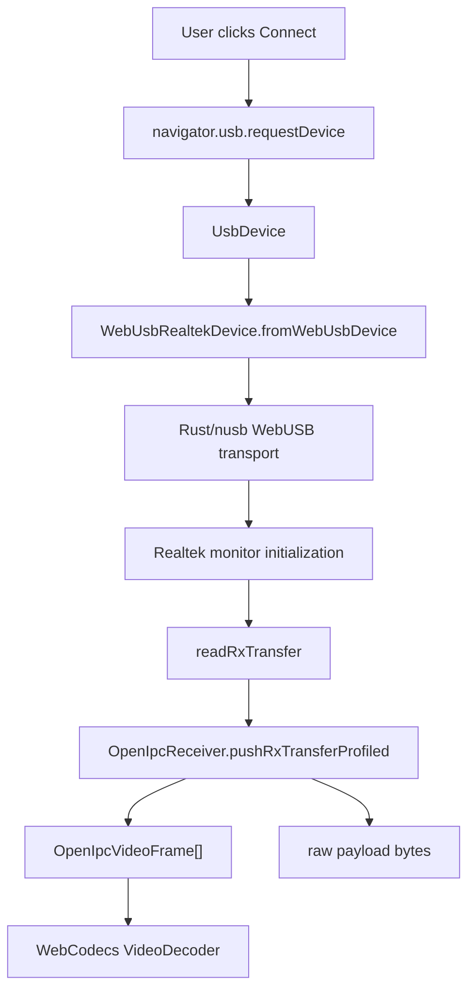

# Web And WASM

The WASM SDK lives in `crates/openipc-web` and is built with
`wasm-bindgen`.

```sh
bun run --cwd crates/openipc-web build
```

The generated package is written to:

```text
crates/openipc-web/pkg
```

That package contains the compiled `.wasm`, JavaScript glue, TypeScript
definitions, npm package metadata, README, and MIT license. The generated output
is ignored by git. CI recreates it when publishing.

For applications outside this repository, install the generated npm package:

```sh
bun add @openipc-rs/web
```

## Browser Flow



1. React calls `navigator.usb.requestDevice` from a user gesture.
2. The browser returns a granted `UsbDevice`.
3. React passes that object to `WebUsbRealtekDevice.fromWebUsbDevice`.
4. Rust/WASM uses `nusb` to claim interface 0 and discover endpoints.
5. The shared Rust Realtek HAL initializes monitor mode and channel settings.
6. Bulk-IN transfer bytes feed the same Rust receiver pipeline used by native.
7. Rust/WASM returns structured video frames, recovered raw payload bytes for
   the configured telemetry port, link metrics, and debug metrics.
8. React sends frames to WebCodecs and renders the decoded output.

## What Crosses The JS/WASM Boundary

The browser path keeps high-volume protocol work in Rust:

1. JavaScript passes one USB transfer buffer to `OpenIpcReceiver`.
2. Rust parses Realtek descriptors, filters packets, decrypts WFB, performs FEC
   recovery, parses RTP for the video channel, and emits encoded video frames.
3. Rust also watches a non-video payload channel and returns recovered bytes
   without parsing the application protocol. The current SDK names this
   convenience output `mavlinkPayloads` because it defaults to the observed
   OpenIPC MAVLink downlink port.
4. JavaScript receives frame objects, raw telemetry payloads, and metrics, then
   feeds compressed video bytes to WebCodecs.

The app does not pass every RTP packet back and forth. It does pass each USB
transfer into WASM, each completed encoded frame back out, and each recovered
telemetry/data payload back out. That is the right boundary for the current
browser design because WebCodecs owns the decoded `VideoFrame` lifecycle and
telemetry parsing is left to application code.

## WebCodecs Boundary

Rust extracts H.264/H.265 Annex-B frames and returns frame metadata. JavaScript
owns WebCodecs because the browser API is naturally tied to rendering,
`VideoFrame` lifetimes, canvas capture, and user-agent codec support.

This keeps the heavy packet/protocol path in Rust while avoiding unnecessary
copies of decoded video surfaces back into WASM.

## Browser Constraints

- WebUSB requires HTTPS or `localhost`.
- `navigator.usb.requestDevice` must be called from a user gesture.
- WebUSB device access can vary by browser and operating system.
- WebCodecs H.264 support is common. H.265 support depends heavily on the
  browser, OS, and hardware decoder availability.
- The station preloads `/gs.key` only when there is no key in local storage.

See [WASM SDK Usage](./wasm-sdk.md) for a complete WebUSB and WebCodecs code
example.
