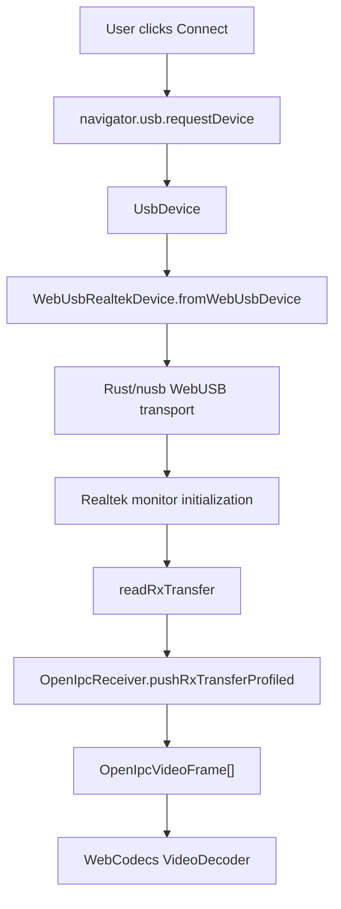

# Web And WASM

The WASM SDK lives in `crates/openipc-web` and is built with
`wasm-bindgen`.

```sh
npm --prefix crates/openipc-web run build
```

The generated package is written to:

```text
crates/openipc-web/pkg
```

That package contains the compiled `.wasm`, JavaScript glue, TypeScript
definitions, npm package metadata, README, and MIT license. The generated output
is ignored by git. CI recreates it when publishing.

## Browser Flow



1. React calls `navigator.usb.requestDevice` from a user gesture.
2. The browser returns a granted `UsbDevice`.
3. React passes that object to `WebUsbRealtekDevice.fromWebUsbDevice`.
4. Rust/WASM uses `nusb` to claim interface 0 and discover endpoints.
5. The shared Rust Realtek HAL initializes monitor mode and channel settings.
6. Bulk-IN transfer bytes feed the same Rust receiver pipeline used by native.
7. Rust/WASM returns structured video frames, link metrics, and debug metrics.
8. React sends frames to WebCodecs and renders the decoded output.

## WebCodecs Boundary

Rust extracts H.264/H.265 Annex-B frames and returns frame metadata. JavaScript
owns WebCodecs because the browser API is naturally tied to rendering,
`VideoFrame` lifetimes, canvas capture, and user-agent codec support.

This keeps the heavy packet/protocol path in Rust while avoiding unnecessary
copies of decoded video surfaces back into WASM.

See [WASM SDK Usage](./wasm-sdk.md) for a complete WebUSB and WebCodecs code
example.
